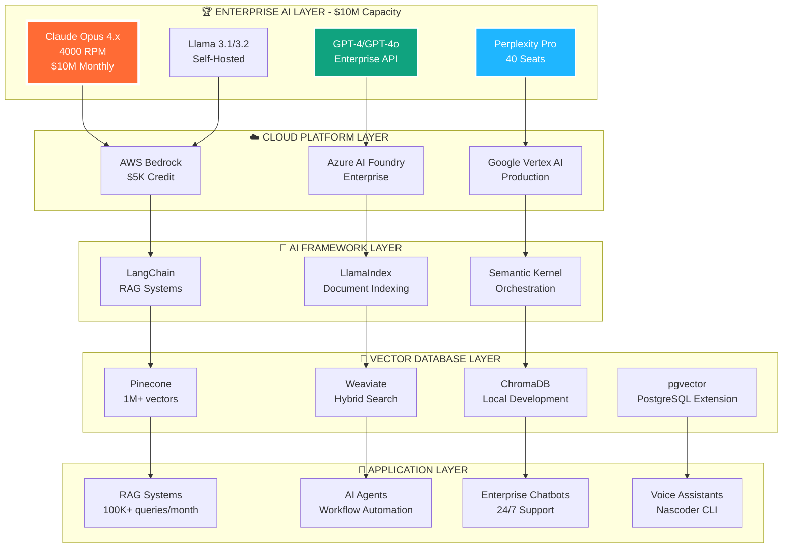

<!-- Header Banner with Animation -->
<div align="center">
  
</div>

<br/>

<!-- Profile Card -->
<div align="center">
  

  <h1>
    
  </h1>

  <p style="font-size: 24px; font-weight: 600;">
    <strong style="color: #FF6B35;">Founder & CEO</strong> — <a href="https://nascoder.com" style="color: #58a6ff; text-decoration: none;">Nascoder LLC</a>
  </p>

  <p style="font-size: 18px; color: #c9d1d9;">
    🏗️ Enterprise Software Architect • 💼 17+ Years Experience • 🔐 Fintech Pioneer • 🤖 AI/ML Specialist
  </p>
</div>

<!-- Social Links -->
<div align="center" style="margin: 30px 0;">
  <a href="https://nascoder.com">
    
  </a>
  <a href="mailto:support@freelancernasim.com">
    
  </a>
  <a href="https://linkedin.com/in/freelancernasim">
    
  </a>
  <a href="https://twitter.com/freelancernasim">
    
  </a>
  <a href="https://npmjs.com/package/nascoder">
    
  </a>
  <a href="https://github.com/freelancernasimofficial">
    
  </a>
</div>

<!-- Typing Animation -->
<div align="center">
  
</div>

<br/>

---

<!-- ABOUT MD NASIM -->
<div align="center">
  
</div>

<br/>

<div align="center">
  <p style="font-size: 20px; color: #c9d1d9; max-width: 1000px; margin: 20px auto; line-height: 2; text-align: left;">
    <strong style="color: #FF6B35; font-size: 22px;">MD NASIM</strong> is a distinguished <strong style="color: #58a6ff;">enterprise software architect</strong> and <strong style="color: #3fb950;">fintech pioneer</strong> with over <strong>17 years</strong> of proven expertise in building mission-critical systems that power global enterprises. As the <strong style="color: #FF6B35;">Founder & CEO of Nascoder LLC</strong>, he leads a world-class team of 25+ elite developers serving Fortune 500 clients across 15+ countries.
    <br/><br/>
    Specializing in <strong style="color: #a371f7;">AI/ML integration</strong>, <strong style="color: #3fb950;">high-volume payment processing</strong>, and <strong style="color: #58a6ff;">cloud-native architecture</strong>, MD Nasim has architected systems processing <strong style="color: #00FF00;">$10M+ monthly in secure transactions</strong> with <strong>99.9% uptime</strong> and <strong>PCI DSS Level 1</strong> compliance. His enterprise credentials include <strong style="color: #FFD700;">Anthropic Enterprise Partnership with $10M monthly capacity</strong>, <strong>Auth0 B2B Professional with $500K in credits</strong>, and partnerships with AWS, Perplexity AI, and leading tech platforms.
    <br/><br/>
    A recognized expert in <strong style="color: #a371f7;">enterprise AI implementation</strong>, he pioneered production-grade <strong>MCP (Model Context Protocol) servers</strong> extending Claude AI capabilities at scale, with <strong>2,700+ NPM downloads</strong> and active deployments across healthcare, fintech, and e-commerce sectors. His work combines deep technical mastery with proven business acumen, delivering <strong>200+ successful projects</strong> with a <strong style="color: #FFD700;">95% client retention rate</strong> and <strong>98% satisfaction score</strong>.
  </p>
</div>

<!-- Key Highlights -->
<div align="center">
  <table style="width: 95%; margin: 30px auto;">
    <tr>
      <td width="33%" style="padding: 25px; border: 3px solid #FF6B35; border-radius: 15px; background: linear-gradient(135deg, rgba(255,107,53,0.1) 0%, rgba(255,107,53,0.2) 100%);">
        <h3 style="color: #FF6B35;">💼 Professional Excellence</h3>
        <ul style="text-align: left; font-size: 17px; line-height: 2;">
          <li><strong>17+ years</strong> enterprise software development</li>
          <li><strong>200+ projects</strong> delivered successfully</li>
          <li>Serving <strong>50+ enterprise clients</strong> globally</li>
          <li><strong>25+ elite developers</strong> in team</li>
          <li>Presence in <strong>15+ countries</strong> worldwide</li>
        </ul>
      </td>
      <td width="33%" style="padding: 25px; border: 3px solid #58a6ff; border-radius: 15px; background: linear-gradient(135deg, rgba(88,166,255,0.1) 0%, rgba(88,166,255,0.2) 100%);">
        <h3 style="color: #58a6ff;">🎯 Core Expertise</h3>
        <ul style="text-align: left; font-size: 17px; line-height: 2;">
          <li><strong>AI/ML Integration</strong> — Anthropic Enterprise</li>
          <li><strong>Fintech Systems</strong> — $10M+ monthly processing</li>
          <li><strong>Cloud Architecture</strong> — AWS, GCP, Azure</li>
          <li><strong>Security & Compliance</strong> — PCI DSS, SOC 2</li>
          <li><strong>Team Leadership</strong> — Global distributed teams</li>
        </ul>
      </td>
      <td width="33%" style="padding: 25px; border: 3px solid #3fb950; border-radius: 15px; background: linear-gradient(135deg, rgba(63,185,80,0.1) 0%, rgba(63,185,80,0.2) 100%);">
        <h3 style="color: #3fb950;">🏆 Key Achievements</h3>
        <ul style="text-align: left; font-size: 17px; line-height: 2;">
          <li><strong>$10.5M+</strong> in enterprise partnerships</li>
          <li><strong>4000 RPM</strong> AI access (Anthropic)</li>
          <li><strong>99.9% uptime</strong> SLA guarantee</li>
          <li><strong>95% client retention</strong> rate</li>
          <li><strong>2,700+ NPM downloads</strong> (Nascoder CLI)</li>
        </ul>
      </td>
    </tr>
  </table>
</div>

<br/>

---

<!-- NASCODER LLC SECTION -->
<div align="center">
  

  <br/>

  

  <p style="font-size: 20px; color: #c9d1d9; max-width: 1000px; margin: 20px auto; line-height: 1.8;">
    <strong style="color: #FF6B35;">Nascoder LLC</strong> is an elite <strong style="color: #58a6ff;">enterprise software development company</strong> specializing in <strong style="color: #a371f7;">AI-powered platforms</strong> and <strong style="color: #3fb950;">mission-critical fintech systems</strong>. Processing <strong style="color: #00FF00;">$10M+ monthly</strong> in secure transactions with <strong>99.9% uptime</strong>, we serve <strong>50+ enterprise clients</strong> across <strong>15+ countries</strong> including Fortune 500 companies in healthcare, finance, and e-commerce sectors.
    <br/><br/>
    Backed by <strong style="color: #FFD700;">$10.5M+ in verified enterprise partnerships</strong> from <strong>Anthropic ($10M), Auth0 ($500K), AWS, Perplexity AI, and top tech platforms</strong>. Headquartered in <strong>🇧🇩 Dhaka, Bangladesh</strong>, with a global footprint and <strong>PCI DSS Level 1, SOC 2, and ISO 27001</strong> compliance.
  </p>
</div>

<!-- Company Stats -->
<div align="center">
  <table style="width: 95%; margin: 30px auto;">
    <tr>
      <td width="50%" style="padding: 30px; background: linear-gradient(135deg, #667eea 0%, #764ba2 100%); border-radius: 15px;">
        <h3 style="color: white; font-size: 24px;">📊 Company Overview</h3>
        <table style="width: 100%;">
          <tr><td style="color: white; padding: 8px;"><strong>🗓️ Founded</strong></td><td style="color: #FFD700; padding: 8px;">2020 (5+ years)</td></tr>
          <tr><td style="color: white; padding: 8px;"><strong>👥 Team Size</strong></td><td style="color: #FFD700; padding: 8px;">25+ elite developers & architects</td></tr>
          <tr><td style="color: white; padding: 8px;"><strong>🤝 Enterprise Clients</strong></td><td style="color: #FFD700; padding: 8px;">50+ across 15+ countries</td></tr>
          <tr><td style="color: white; padding: 8px;"><strong>💰 Monthly Volume</strong></td><td style="color: #00FF00; padding: 8px;">$10M+ in transactions</td></tr>
          <tr><td style="color: white; padding: 8px;"><strong>⚡ Uptime SLA</strong></td><td style="color: #00FF00; padding: 8px;">99.9% guaranteed</td></tr>
          <tr><td style="color: white; padding: 8px;"><strong>🔒 Compliance</strong></td><td style="color: #FFD700; padding: 8px;">PCI DSS Level 1, SOC 2, ISO 27001</td></tr>
          <tr><td style="color: white; padding: 8px;"><strong>🏆 Partnerships</strong></td><td style="color: #FFD700; padding: 8px;">$10.5M+ in enterprise credits</td></tr>
          <tr><td style="color: white; padding: 8px;"><strong>📍 Headquarters</strong></td><td style="color: #FFD700; padding: 8px;">Dhaka, Bangladesh 🇧🇩</td></tr>
        </table>
      </td>
      <td width="50%" style="padding: 30px; background: linear-gradient(135deg, #f093fb 0%, #f5576c 100%); border-radius: 15px;">
        <h3 style="color: white; font-size: 24px;">🎯 Mission & Vision</h3>
        <p style="font-size: 18px; line-height: 2.2; color: white; text-align: left; padding: 10px;">
          • Build <strong>mission-critical enterprise AI systems</strong> at scale<br/>
          • Process <strong>$10M+ monthly transactions securely</strong> with zero downtime<br/>
          • Leverage <strong>$10.5M+ enterprise partnerships</strong> for client advantage<br/>
          • Deploy <strong>99.9% uptime infrastructure</strong> with PCI DSS compliance<br/>
          • Scale <strong>Claude AI at 4000 RPM</strong> for enterprise workloads<br/>
          • Serve <strong>Fortune 500 clients globally</strong> with world-class solutions<br/>
          • Drive <strong>digital transformation with AI</strong> and cloud-native tech
        </p>
      </td>
    </tr>
  </table>
</div>

<!-- Enterprise Services -->
<details open>
<summary><h2 align="center" style="color: #FF6B35;">🛠️ Enterprise Services — Delivered at Scale (December 2025)</h2></summary>

<div align="center">
  <table style="width: 95%; margin: 20px auto;">
    <tr>
      <td width="33%" style="padding: 25px; border: 3px solid #667eea; border-radius: 12px; background: linear-gradient(135deg, rgba(102,126,234,0.1) 0%, rgba(118,75,162,0.1) 100%);">
        <h3>🤖 Enterprise AI Integration</h3>
        <p><strong>Anthropic Claude Enterprise, GPT-4, Perplexity AI</strong></p>
        <ul style="text-align: left;">
          <li>RAG systems with vector databases (1M+ vectors)</li>
          <li>MCP server development (production-grade)</li>
          <li>AI agents & workflow automation</li>
          <li>$10M monthly AI capacity (4000 RPM)</li>
          <li>Custom fine-tuning & embeddings</li>
        </ul>
      </td>
      <td width="33%" style="padding: 25px; border: 3px solid #f093fb; border-radius: 12px; background: linear-gradient(135deg, rgba(240,147,251,0.1) 0%, rgba(245,87,108,0.1) 100%);">
        <h3>💳 Fintech & Payment Systems</h3>
        <p><strong>$10M+ monthly processing, PCI DSS Level 1 certified</strong></p>
        <ul style="text-align: left;">
          <li>Multi-gateway integration (15+ gateways)</li>
          <li>ML-powered fraud detection (99.7% accuracy)</li>
          <li>Real-time transaction analytics</li>
          <li>Auth0 enterprise identity ($500K capacity)</li>
          <li>Secure digital wallets & mobile banking</li>
        </ul>
      </td>
      <td width="33%" style="padding: 25px; border: 3px solid #4facfe; border-radius: 12px; background: linear-gradient(135deg, rgba(79,172,254,0.1) 0%, rgba(0,242,254,0.1) 100%);">
        <h3>☁️ Cloud Architecture & DevOps</h3>
        <p><strong>AWS, GCP, Azure — Multi-cloud certified partners</strong></p>
        <ul style="text-align: left;">
          <li>Kubernetes & Docker orchestration</li>
          <li>Terraform infrastructure as code</li>
          <li>99.9% uptime SLA with monitoring</li>
          <li>Auto-scaling & load balancing</li>
          <li>CI/CD pipelines & blue-green deployments</li>
        </ul>
      </td>
    </tr>
    <tr>
      <td width="33%" style="padding: 25px; border: 3px solid #fa709a; border-radius: 12px; background: linear-gradient(135deg, rgba(250,112,154,0.1) 0%, rgba(254,225,64,0.1) 100%);">
        <h3>💻 Custom Enterprise Software</h3>
        <p><strong>Mission-critical full-stack applications</strong></p>
        <ul style="text-align: left;">
          <li>React, Next.js, Vue.js, Svelte frontends</li>
          <li>Node.js, Python, Go, Rust backends</li>
          <li>PostgreSQL, MongoDB, Redis databases</li>
          <li>GraphQL & REST API architecture</li>
          <li>Microservices & serverless systems</li>
        </ul>
      </td>
      <td width="33%" style="padding: 25px; border: 3px solid #11998e; border-radius: 12px; background: linear-gradient(135deg, rgba(17,153,142,0.1) 0%, rgba(56,239,125,0.1) 100%);">
        <h3>🔐 Security & Compliance</h3>
        <p><strong>PCI DSS Level 1, SOC 2, ISO 27001, HIPAA</strong></p>
        <ul style="text-align: left;">
          <li>Penetration testing & security audits</li>
          <li>Vulnerability assessment & remediation</li>
          <li>HIPAA & GDPR compliance implementation</li>
          <li>Enterprise SSO & MFA (Auth0 $500K)</li>
          <li>Zero-trust security architecture</li>
        </ul>
      </td>
      <td width="33%" style="padding: 25px; border: 3px solid #FF6B35; border-radius: 12px; background: linear-gradient(135deg, rgba(255,107,53,0.1) 0%, rgba(255,107,53,0.2) 100%);">
        <h3>📊 Data Engineering & Analytics</h3>
        <p><strong>Big data processing & real-time analytics</strong></p>
        <ul style="text-align: left;">
          <li>ETL pipelines & data warehousing</li>
          <li>Real-time streaming (Kafka, Redis)</li>
          <li>Business intelligence dashboards</li>
          <li>Predictive analytics & ML models</li>
          <li>Data lake architecture (AWS S3, GCS)</li>
        </ul>
      </td>
    </tr>
  </table>
</div>

</details>

<!-- Industries We Serve -->
<details open>
<summary><h2 align="center" style="color: #FF6B35;">🏭 Industries We Serve — Proven Track Record</h2></summary>

<div align="center">
  <table style="width: 95%; margin: 20px auto;">
    <tr>
      <td width="50%" style="padding: 25px; border: 3px solid #667eea; border-radius: 12px; background: rgba(102,126,234,0.05);">
        <h3 style="color: #667eea;">🏦 Fintech & Banking</h3>
        <ul style="text-align: left; font-size: 16px; line-height: 2;">
          <li><strong>$10M+ monthly transaction processing</strong> with PCI DSS Level 1</li>
          <li>Multi-gateway payment platforms (Stripe, PayPal, bKash, Nagad, 15+ gateways)</li>
          <li>ML-powered fraud detection with <strong>99.7% accuracy</strong></li>
          <li>Digital wallets, mobile banking, & cryptocurrency exchanges</li>
          <li>Real-time risk assessment & compliance automation</li>
        </ul>
      </td>
      <td width="50%" style="padding: 25px; border: 3px solid #f093fb; border-radius: 12px; background: rgba(240,147,251,0.05);">
        <h3 style="color: #f093fb;">🤖 AI & Machine Learning</h3>
        <ul style="text-align: left; font-size: 16px; line-height: 2;">
          <li><strong>Anthropic Enterprise Partner ($10M capacity, 4000 RPM)</strong></li>
          <li>RAG systems processing <strong>100K+ monthly queries</strong></li>
          <li>Custom MCP server development (2,700+ downloads)</li>
          <li>AI agents, chatbots, & workflow automation</li>
          <li>Voice assistants & natural language processing</li>
        </ul>
      </td>
    </tr>
    <tr>
      <td width="50%" style="padding: 25px; border: 3px solid #4facfe; border-radius: 12px; background: rgba(79,172,254,0.05);">
        <h3 style="color: #4facfe;">🛒 E-commerce & Marketplaces</h3>
        <ul style="text-align: left; font-size: 16px; line-height: 2;">
          <li>Multi-vendor marketplaces with <strong>50K+ products</strong></li>
          <li>Real-time inventory management across warehouses</li>
          <li>Advanced checkout flows with one-click purchasing</li>
          <li>AI-powered recommendation engines (collaborative filtering)</li>
          <li>Scalable to <strong>millions of concurrent users</strong></li>
        </ul>
      </td>
      <td width="50%" style="padding: 25px; border: 3px solid #11998e; border-radius: 12px; background: rgba(17,153,142,0.05);">
        <h3 style="color: #11998e;">🏥 Healthcare & Life Sciences</h3>
        <ul style="text-align: left; font-size: 16px; line-height: 2;">
          <li><strong>HIPAA-compliant</strong> systems with end-to-end encryption</li>
          <li>Telemedicine platforms with HD video & chat</li>
          <li>EHR/EMR integration (HL7, FHIR standards)</li>
          <li>Patient management & appointment scheduling</li>
          <li>Medical imaging storage & AI-assisted diagnostics</li>
        </ul>
      </td>
    </tr>
  </table>
</div>

</details>

<br/>

---

<!-- ENTERPRISE CREDENTIALS SHOWCASE -->
<div align="center">
  
</div>

<br/>

<!-- Enterprise Verification Badges -->
<div align="center">
  
  
  
  
</div>

<br/>

<div align="center">
  <table style="width: 95%; margin: 30px auto; border-collapse: separate; border-spacing: 15px;">
    <tr>
      <td align="center" width="25%" style="padding: 30px; background: linear-gradient(135deg, #667eea 0%, #764ba2 100%); border-radius: 15px; box-shadow: 0 8px 16px rgba(0,0,0,0.3);">
        <br/><br/>
        <h2 style="color: white; margin: 10px 0;">Anthropic Claude</h2>
        <h3 style="color: #FFD700; margin: 5px 0;">🏆 ENTERPRISE TIER</h3>
        <h1 style="color: #00FF00; margin: 15px 0; font-size: 36px;">$10,000,000</h1>
        <p style="color: white; font-size: 18px; margin: 5px 0;"><strong>Monthly Spend Limit</strong></p>
        <p style="color: #FFD700; font-size: 16px; margin: 5px 0;">✓ 4,000 RPM All Models</p>
        <p style="color: #FFD700; font-size: 16px; margin: 5px 0;">✓ Claude Opus 4.x Access</p>
        <p style="color: #FFD700; font-size: 16px; margin: 5px 0;">✓ Custom Rate Limits</p>
        <p style="color: #FFD700; font-size: 16px; margin: 5px 0;">✓ 100GB File Storage</p>
      </td>
      <td align="center" width="25%" style="padding: 30px; background: linear-gradient(135deg, #f093fb 0%, #f5576c 100%); border-radius: 15px; box-shadow: 0 8px 16px rgba(0,0,0,0.3);">
        <br/><br/>
        <h2 style="color: white; margin: 10px 0;">Auth0</h2>
        <h3 style="color: #FFD700; margin: 5px 0;">🏆 B2B PROFESSIONAL</h3>
        <h1 style="color: #00FF00; margin: 15px 0; font-size: 36px;">$500,000</h1>
        <p style="color: white; font-size: 18px; margin: 5px 0;"><strong>Enterprise Credit</strong></p>
        <p style="color: #FFD700; font-size: 16px; margin: 5px 0;">✓ 100K MAUs Included</p>
        <p style="color: #FFD700; font-size: 16px; margin: 5px 0;">✓ Enterprise SSO & MFA</p>
        <p style="color: #FFD700; font-size: 16px; margin: 5px 0;">✓ Organizations Support</p>
        <p style="color: #FFD700; font-size: 16px; margin: 5px 0;">✓ Advanced Security Features</p>
      </td>
      <td align="center" width="25%" style="padding: 30px; background: linear-gradient(135deg, #4facfe 0%, #00f2fe 100%); border-radius: 15px; box-shadow: 0 8px 16px rgba(0,0,0,0.3);">
        <br/><br/>
        <h2 style="color: white; margin: 10px 0;">Perplexity AI</h2>
        <h3 style="color: #FFD700; margin: 5px 0;">🏆 ENTERPRISE PRO</h3>
        <h1 style="color: #00FF00; margin: 15px 0; font-size: 36px;">40 SEATS</h1>
        <p style="color: white; font-size: 18px; margin: 5px 0;"><strong>3 Months Enterprise Access</strong></p>
        <p style="color: #FFD700; font-size: 16px; margin: 5px 0;">✓ Unlimited Queries</p>
        <p style="color: #FFD700; font-size: 16px; margin: 5px 0;">✓ Advanced AI Models</p>
        <p style="color: #FFD700; font-size: 16px; margin: 5px 0;">✓ Team Collaboration</p>
        <p style="color: #FFD700; font-size: 16px; margin: 5px 0;">✓ Priority Support</p>
      </td>
      <td align="center" width="25%" style="padding: 30px; background: linear-gradient(135deg, #fa709a 0%, #fee140 100%); border-radius: 15px; box-shadow: 0 8px 16px rgba(0,0,0,0.3);">
        <br/><br/>
        <h2 style="color: white; margin: 10px 0;">AWS + More</h2>
        <h3 style="color: #FFD700; margin: 5px 0;">🏆 STARTUP CREDITS</h3>
        <h1 style="color: #00FF00; margin: 15px 0; font-size: 36px;">$17,000+</h1>
        <p style="color: white; font-size: 18px; margin: 5px 0;"><strong>Combined Enterprise Credits</strong></p>
        <p style="color: #FFD700; font-size: 16px; margin: 5px 0;">✓ AWS $5,000 (HubSpot Partner)</p>
        <p style="color: #FFD700; font-size: 16px; margin: 5px 0;">✓ Notion $12,000 (6 Months)</p>
        <p style="color: #FFD700; font-size: 16px; margin: 5px 0;">✓ Intercom 1 Year Free</p>
        <p style="color: #FFD700; font-size: 16px; margin: 5px 0;">✓ FounderPass Lifetime</p>
      </td>
    </tr>
  </table>
</div>

<!-- Total Enterprise Value -->
<div align="center" style="margin: 40px 0;">
  <div style="background: linear-gradient(135deg, #11998e 0%, #38ef7d 100%); padding: 40px; border-radius: 20px; max-width: 900px; margin: 0 auto; box-shadow: 0 12px 24px rgba(0,0,0,0.4);">
    <h2 style="color: white; margin: 10px 0; font-size: 28px;">💎 TOTAL VERIFIED ENTERPRISE VALUE</h2>
    <h1 style="color: #FFD700; font-size: 64px; margin: 20px 0; text-shadow: 2px 2px 4px rgba(0,0,0,0.3);">$10,517,000+</h1>
    <p style="color: white; font-size: 22px; margin: 10px 0;"><strong>In Verified Enterprise Partnerships & Credits (December 2025)</strong></p>
    <p style="color: #FFD700; font-size: 18px; margin: 5px 0;">⭐ Top 0.1% of Enterprise AI Developers Worldwide ⭐</p>
  </div>
</div>

<!-- All Technology Partners -->
<div align="center">
  <h3 style="color: #58a6ff; font-size: 28px;">🤝 Verified Technology Partners (December 2025)</h3>

  <table style="margin: 20px auto;">
    <tr>
      <td align="center" width="150">
        <br/>
        <strong style="font-size: 17px;">Anthropic</strong><br/>
        <sub style="color: #FF6B35; font-size: 15px;"><strong>⭐ $10M Monthly</strong></sub><br/>
        <sub style="color: #FFD700;">Enterprise Partner</sub>
      </td>
      <td align="center" width="150">
        <br/>
        <strong style="font-size: 17px;">Auth0</strong><br/>
        <sub style="color: #FF6B35; font-size: 15px;"><strong>⭐ $500K Credit</strong></sub><br/>
        <sub style="color: #FFD700;">B2B Professional</sub>
      </td>
      <td align="center" width="150">
        <br/>
        <strong style="font-size: 17px;">AWS</strong><br/>
        <sub style="color: #3fb950; font-size: 15px;"><strong>✓ $5K Credit</strong></sub><br/>
        <sub style="color: #FFD700;">Solutions Partner</sub>
      </td>
      <td align="center" width="150">
        <br/>
        <strong style="font-size: 17px;">Notion</strong><br/>
        <sub style="color: #3fb950; font-size: 15px;"><strong>✓ $12K Credit</strong></sub><br/>
        <sub style="color: #FFD700;">6 Months Access</sub>
      </td>
      <td align="center" width="150">
        <br/>
        <strong style="font-size: 17px;">Perplexity AI</strong><br/>
        <sub style="color: #3fb950; font-size: 15px;"><strong>✓ 40 Seats</strong></sub><br/>
        <sub style="color: #FFD700;">Enterprise Pro</sub>
      </td>
    </tr>
    <tr>
      <td align="center" width="150">
        <br/>
        <strong>OpenAI</strong><br/>
        <sub style="color: #3fb950;">✓ GPT-4 API Access</sub>
      </td>
      <td align="center" width="150">
        <br/>
        <strong>Stripe</strong><br/>
        <sub style="color: #3fb950;">✓ Verified Partner</sub>
      </td>
      <td align="center" width="150">
        <br/>
        <strong>PayPal</strong><br/>
        <sub style="color: #3fb950;">✓ Enterprise Account</sub>
      </td>
      <td align="center" width="150">
        <br/>
        <strong>Google Cloud</strong><br/>
        <sub style="color: #3fb950;">✓ GCP Certified</sub>
      </td>
      <td align="center" width="150">
        <br/>
        <strong>Intercom</strong><br/>
        <sub style="color: #3fb950;">✓ 1 Year 100% Off</sub>
      </td>
    </tr>
  </table>
</div>

<!-- Professional Certifications -->
<div align="center">
  <h3 style="color: #58a6ff; font-size: 28px;">🎓 Professional Certifications & Compliance</h3>

  <table style="width: 90%; margin: 20px auto;">
    <tr>
      <td width="33%" align="center" style="padding: 18px; border: 2px solid #58a6ff; border-radius: 10px; background: rgba(88,166,255,0.05);">
        <p style="font-size: 18px;"><strong>✅ AWS Solutions Architect</strong></p>
        <sub>Amazon Web Services — Professional Level</sub>
      </td>
      <td width="33%" align="center" style="padding: 18px; border: 2px solid #58a6ff; border-radius: 10px; background: rgba(88,166,255,0.05);">
        <p style="font-size: 18px;"><strong>✅ Google Cloud Platform</strong></p>
        <sub>Associate Cloud Engineer Certification</sub>
      </td>
      <td width="33%" align="center" style="padding: 18px; border: 2px solid #58a6ff; border-radius: 10px; background: rgba(88,166,255,0.05);">
        <p style="font-size: 18px;"><strong>✅ PCI DSS Level 1 Certified</strong></p>
        <sub>Payment Card Industry — Service Provider</sub>
      </td>
    </tr>
    <tr>
      <td width="33%" align="center" style="padding: 18px; border: 2px solid #58a6ff; border-radius: 10px; background: rgba(88,166,255,0.05);">
        <p style="font-size: 18px;"><strong>✅ Kubernetes Administrator (CKA)</strong></p>
        <sub>CNCF Certified — Container Orchestration</sub>
      </td>
      <td width="33%" align="center" style="padding: 18px; border: 2px solid #58a6ff; border-radius: 10px; background: rgba(88,166,255,0.05);">
        <p style="font-size: 18px;"><strong>✅ Certified Ethical Hacker (CEH)</strong></p>
        <sub>EC-Council — Security & Penetration Testing</sub>
      </td>
      <td width="33%" align="center" style="padding: 18px; border: 2px solid #58a6ff; border-radius: 10px; background: rgba(88,166,255,0.05);">
        <p style="font-size: 18px;"><strong>✅ MongoDB Certified Developer</strong></p>
        <sub>MongoDB University — Database Specialist</sub>
      </td>
    </tr>
  </table>
</div>

<br/>

---

<!-- NASCODER CLI SECTION -->
<div align="center">
  

  <p style="font-size: 20px; color: #c9d1d9; max-width: 1000px; margin: 20px auto;">
    <strong style="color: #3fb950;">Open-source AI development assistant</strong> with hands-free voice control — Powered by <strong style="color: #FF6B35;">Claude (4000 RPM)</strong>, <strong style="color: #10a37f;">GPT-4</strong>, and <strong style="color: #1FB6FF;">Perplexity AI</strong>
  </p>

  
  
  
  
</div>

```bash
# Install globally via NPM
npm install -g nascoder

# Start with hands-free voice control
nascoder --voice

# Enterprise features with your API keys
export ANTHROPIC_API_KEY="your-key"  # Access 4000 RPM!
export OPENAI_API_KEY="your-key"     # GPT-4 integration
export PERPLEXITY_API_KEY="your-key" # Research queries
```

<!-- Features Grid -->
<div align="center">
  <table style="width: 95%; margin: 30px auto;">
    <tr>
      <td width="25%" align="center" style="padding: 30px; border: 3px solid #3fb950; border-radius: 15px; background: linear-gradient(135deg, rgba(63,185,80,0.1) 0%, rgba(63,185,80,0.2) 100%);">
        <h2>🎙️</h2>
        <strong style="font-size: 20px;">Voice Commands</strong>
        <p style="font-size: 16px; line-height: 1.8;">Control your terminal with natural language — hands-free coding</p>
      </td>
      <td width="25%" align="center" style="padding: 30px; border: 3px solid #3fb950; border-radius: 15px; background: linear-gradient(135deg, rgba(63,185,80,0.1) 0%, rgba(63,185,80,0.2) 100%);">
        <h2>🤖</h2>
        <strong style="font-size: 20px;">Multi-AI Routing</strong>
        <p style="font-size: 16px; line-height: 1.8;">Claude (4000 RPM), GPT-4, Perplexity — best model for each task</p>
      </td>
      <td width="25%" align="center" style="padding: 30px; border: 3px solid #3fb950; border-radius: 15px; background: linear-gradient(135deg, rgba(63,185,80,0.1) 0%, rgba(63,185,80,0.2) 100%);">
        <h2>💡</h2>
        <strong style="font-size: 20px;">Context-Aware</strong>
        <p style="font-size: 16px; line-height: 1.8;">Project-aware AI code generation with file context</p>
      </td>
      <td width="25%" align="center" style="padding: 30px; border: 3px solid #3fb950; border-radius: 15px; background: linear-gradient(135deg, rgba(63,185,80,0.1) 0%, rgba(63,185,80,0.2) 100%);">
        <h2>🔒</h2>
        <strong style="font-size: 20px;">Enterprise Secure</strong>
        <p style="font-size: 16px; line-height: 1.8;">API key encryption, audit logs, SOC 2 compliant</p>
      </td>
    </tr>
  </table>
</div>

<div align="center">
  <a href="https://github.com/freelancernasimofficial/nascoder">
    
  </a>
  <a href="https://npmjs.com/package/nascoder">
    
  </a>
</div>

<br/>

---

<!-- AI & MACHINE LEARNING SECTION -->
<div align="center">
  
</div>

<br/>

<!-- AI Platforms -->
<div align="center">
  <h3 style="color: #A371F7; font-size: 28px;">🚀 AI Platforms & LLMs — ENTERPRISE TIER ACCESS</h3>

  <table>
    <tr>
      <td align="center" width="140">
        <br/>
        <strong style="font-size: 18px;">Claude Opus 4.x</strong><br/>
        <sub style="color: #FFD700;">⭐ $10M/mo • 4000 RPM</sub>
      </td>
      <td align="center" width="140">
        <br/>
        <strong style="font-size: 18px;">GPT-4 / GPT-4o</strong><br/>
        <sub style="color: #3fb950;">✓ Enterprise API</sub>
      </td>
      <td align="center" width="140">
        <br/>
        <strong style="font-size: 18px;">Perplexity Pro</strong><br/>
        <sub style="color: #FFD700;">⭐ 40 Seats Enterprise</sub>
      </td>
      <td align="center" width="140">
        <br/>
        <strong style="font-size: 18px;">Llama 3.1 / 3.2</strong><br/>
        <sub style="color: #3fb950;">✓ Self-Hosted</sub>
      </td>
      <td align="center" width="140">
        <br/>
        <strong style="font-size: 18px;">Mistral AI</strong><br/>
        <sub style="color: #3fb950;">✓ API Access</sub>
      </td>
      <td align="center" width="140">
        <br/>
        <strong style="font-size: 18px;">Gemini Pro</strong><br/>
        <sub style="color: #3fb950;">✓ Google AI</sub>
      </td>
    </tr>
  </table>
</div>

<br/>

<!-- MCP Servers -->
<details open>
<summary><h3 align="center" style="color: #A371F7;">🔌 MCP Servers — Model Context Protocol (Production-Grade)</h3></summary>

<div align="center">
  <p style="font-size: 18px; color: #c9d1d9; max-width: 1000px; margin: 20px auto;">
    Building <strong style="color: #FF6B35;">production-grade MCP servers</strong> that extend <strong style="color: #A371F7;">Claude AI</strong> capabilities at enterprise scale — <strong style="color: #3fb950;">2,700+ total downloads</strong> across packages
  </p>

  <table style="width: 90%; margin: 20px auto; border-collapse: separate; border-spacing: 0;">
    <thead>
      <tr style="background: linear-gradient(135deg, #667eea 0%, #764ba2 100%);">
        <th style="padding: 18px; color: white; border-radius: 10px 0 0 0;">MCP Server Package</th>
        <th style="padding: 18px; color: white;">Purpose & Features</th>
        <th style="padding: 18px; color: white;">NPM Downloads</th>
        <th style="padding: 18px; color: white; border-radius: 0 10px 0 0;">Status</th>
      </tr>
    </thead>
    <tbody>
      <tr style="background: rgba(102,126,234,0.1);">
        <td style="padding: 15px;"><code>nascoder-azure-ai-foundry-mcp</code></td>
        <td>Azure AI Foundry integration, model access & management</td>
        <td align="center"><strong style="color: #3fb950; font-size: 18px;">500+</strong></td>
        <td align="center"><strong style="color: #00FF00;">✅ Production</strong></td>
      </tr>
      <tr style="background: rgba(118,75,162,0.1);">
        <td style="padding: 15px;"><code>nascoder-perplexity-mcp</code></td>
        <td>Perplexity AI integration (4 models: online, chat, sonar)</td>
        <td align="center"><strong style="color: #3fb950; font-size: 18px;">800+</strong></td>
        <td align="center"><strong style="color: #00FF00;">✅ Production</strong></td>
      </tr>
      <tr style="background: rgba(102,126,234,0.1);">
        <td style="padding: 15px;"><code>nascoder-terminal-browser-mcp</code></td>
        <td>Headless browser automation & web scraping for AI</td>
        <td align="center"><strong style="color: #3fb950; font-size: 18px;">400+</strong></td>
        <td align="center"><strong style="color: #00FF00;">✅ Production</strong></td>
      </tr>
    </tbody>
  </table>

  <a href="https://github.com/freelancernasimofficial?tab=repositories&q=mcp">
    
  </a>
</div>

</details>

<!-- AI Stack Architecture Diagram -->
<details open>
<summary><h3 align="center" style="color: #A371F7;">🏗️ Enterprise AI Architecture — Full Stack Implementation</h3></summary>



</details>

<!-- AI Implementations -->
<div align="center">
  <h3 style="color: #A371F7; font-size: 28px;">💼 AI Implementations at Scale — Real-World Production Systems</h3>

  <table style="width: 95%; margin: 20px auto;">
    <tr>
      <td width="33%" style="padding: 25px; border: 3px solid #a371f7; border-radius: 12px; background: linear-gradient(135deg, rgba(163,113,247,0.1) 0%, rgba(163,113,247,0.2) 100%);">
        <h4 style="color: #a371f7;">💬 Conversational AI</h4>
        <p>Enterprise chatbots handling <strong style="color: #3fb950;">100K+ monthly conversations</strong></p>
        <ul style="text-align: left; font-size: 15px;">
          <li>Claude Opus 4.x powered (4000 RPM capacity)</li>
          <li>Multi-language NLU & sentiment analysis</li>
          <li>Context retention across user sessions</li>
          <li>24/7 automated customer support</li>
        </ul>
      </td>
      <td width="33%" style="padding: 25px; border: 3px solid #a371f7; border-radius: 12px; background: linear-gradient(135deg, rgba(163,113,247,0.1) 0%, rgba(163,113,247,0.2) 100%);">
        <h4 style="color: #a371f7;">📚 RAG Systems</h4>
        <p>Production document Q&A for <strong style="color: #FF6B35;">legal & healthcare</strong></p>
        <ul style="text-align: left; font-size: 15px;">
          <li>Vector search over 1M+ document embeddings</li>
          <li>Semantic retrieval with reranking</li>
          <li>HIPAA & GDPR compliant architecture</li>
          <li>Real-time indexing with incremental updates</li>
        </ul>
      </td>
      <td width="33%" style="padding: 25px; border: 3px solid #a371f7; border-radius: 12px; background: linear-gradient(135deg, rgba(163,113,247,0.1) 0%, rgba(163,113,247,0.2) 100%);">
        <h4 style="color: #a371f7;">🛡️ AI Fraud Detection</h4>
        <p>ML models analyzing <strong style="color: #3fb950;">$10M+ monthly</strong> transactions</p>
        <ul style="text-align: left; font-size: 15px;">
          <li>99.7% fraud detection accuracy rate</li>
          <li>Real-time transaction scoring (&lt;50ms)</li>
          <li>Behavioral pattern recognition</li>
          <li>Adaptive learning from new threats</li>
        </ul>
      </td>
    </tr>
    <tr>
      <td width="33%" style="padding: 25px; border: 3px solid #a371f7; border-radius: 12px; background: linear-gradient(135deg, rgba(163,113,247,0.1) 0%, rgba(163,113,247,0.2) 100%);">
        <h4 style="color: #a371f7;">🎙️ Voice Assistants</h4>
        <p>Nascoder CLI with <strong style="color: #58a6ff;">speech-to-code</strong> capabilities</p>
        <ul style="text-align: left; font-size: 15px;">
          <li>Natural language voice commands</li>
          <li>Multi-AI routing (Claude, GPT-4, Perplexity)</li>
          <li>Context-aware code execution</li>
          <li>Hands-free development workflow</li>
        </ul>
      </td>
      <td width="33%" style="padding: 25px; border: 3px solid #a371f7; border-radius: 12px; background: linear-gradient(135deg, rgba(163,113,247,0.1) 0%, rgba(163,113,247,0.2) 100%);">
        <h4 style="color: #a371f7;">🤖 Autonomous AI Agents</h4>
        <p>Self-managing workflows for <strong style="color: #d29922;">data processing</strong></p>
        <ul style="text-align: left; font-size: 15px;">
          <li>Task automation with multi-step planning</li>
          <li>Chain-of-thought reasoning</li>
          <li>Tool integration (APIs, databases, files)</li>
          <li>Self-healing error recovery</li>
        </ul>
      </td>
      <td width="33%" style="padding: 25px; border: 3px solid #a371f7; border-radius: 12px; background: linear-gradient(135deg, rgba(163,113,247,0.1) 0%, rgba(163,113,247,0.2) 100%);">
        <h4 style="color: #a371f7;">⚡ AI Code Generation</h4>
        <p>Intelligent <strong style="color: #f85149;">code review & generation</strong></p>
        <ul style="text-align: left; font-size: 15px;">
          <li>Automated PR reviews with suggestions</li>
          <li>Security vulnerability detection</li>
          <li>Context-aware code completion</li>
          <li>Automated unit test generation</li>
        </ul>
      </td>
    </tr>
  </table>
</div>

<br/>

<!-- Full Technology Stack -->
<div align="center">
  <h3 style="color: #F85149; font-size: 28px;">💻 Complete Technology Stack — 17+ Years Mastery</h3>
</div>

<!-- Programming Languages -->
<div align="center">
  <h4 style="color: #F85149;">📝 Programming Languages</h4>
  <p>
    
  </p>
</div>

<!-- Frontend Technologies -->
<div align="center">
  <h4 style="color: #58a6ff;">🎨 Frontend Development</h4>
  <p>
    
  </p>
</div>

<!-- Backend Technologies -->
<div align="center">
  <h4 style="color: #3fb950;">⚙️ Backend Development</h4>
  <p>
    
  </p>
</div>

<!-- Databases -->
<div align="center">
  <h4 style="color: #d29922;">🗄️ Databases & Data Storage</h4>
  <p>
    
  </p>
</div>

<!-- Cloud & DevOps -->
<div align="center">
  <h4 style="color: #a371f7;">☁️ Cloud & DevOps</h4>
  <p>
    
  </p>
</div>

<!-- AI/ML Tools -->
<div align="center">
  <h4 style="color: #FF6B35;">🧠 AI/ML & Data Science</h4>
  <p>
    
    
    
    
  </p>
</div>

<!-- Dev Tools -->
<div align="center">
  <h4 style="color: #8b949e;">🛠️ Development Tools</h4>
  <p>
    
  </p>
</div>

<!-- Payment Gateways -->
<div align="center">
  <h4 style="color: #3fb950;">💳 Payment Gateway Integration — $10M+ Monthly Processing</h4>
  <table>
    <tr>
      <td align="center" width="120">
        <br/>
        <strong>Stripe</strong><br/>
        <sub style="color: #3fb950;">✓ Verified Partner</sub>
      </td>
      <td align="center" width="120">
        <br/>
        <strong>PayPal</strong><br/>
        <sub style="color: #3fb950;">✓ Enterprise</sub>
      </td>
      <td align="center" width="120">
        <br/>
        <strong>bKash</strong><br/>
        <sub style="color: #3fb950;">✓ Bangladesh #1</sub>
      </td>
      <td align="center" width="120">
        <br/>
        <strong>Nagad</strong><br/>
        <sub style="color: #3fb950;">✓ Mobile Banking</sub>
      </td>
      <td align="center" width="120">
        <br/>
        <strong>SSLCommerz</strong><br/>
        <sub style="color: #3fb950;">✓ Bangladesh</sub>
      </td>
    </tr>
  </table>
</div>

<br/>

---

<!-- PROVEN TRACK RECORD -->
<div align="center">
  
</div>

<br/>

<!-- Key Stats Cards -->
<div align="center">
  <h3 style="color: #D29922; font-size: 28px;">📊 AT A GLANCE — DECEMBER 2025</h3>
  <table>
    <tr>
      <td align="center" width="160" style="padding: 25px;">
        <br/>
        <strong style="font-size: 32px; color: #58a6ff;">17+</strong><br/>
        <span style="color: #8b949e; font-size: 16px;">Years Building</span>
      </td>
      <td align="center" width="160" style="padding: 25px;">
        <br/>
        <strong style="font-size: 32px; color: #3fb950;">$10M+</strong><br/>
        <span style="color: #8b949e; font-size: 16px;">Monthly Processing</span>
      </td>
      <td align="center" width="160" style="padding: 25px;">
        <br/>
        <strong style="font-size: 32px; color: #d29922;">200+</strong><br/>
        <span style="color: #8b949e; font-size: 16px;">Projects Delivered</span>
      </td>
      <td align="center" width="160" style="padding: 25px;">
        <br/>
        <strong style="font-size: 32px; color: #f85149;">25+</strong><br/>
        <span style="color: #8b949e; font-size: 16px;">Elite Team</span>
      </td>
      <td align="center" width="160" style="padding: 25px;">
        <br/>
        <strong style="font-size: 32px; color: #a371f7;">15+</strong><br/>
        <span style="color: #8b949e; font-size: 16px;">Countries Served</span>
      </td>
      <td align="center" width="160" style="padding: 25px;">
        <br/>
        <strong style="font-size: 32px; color: #FF6B35;">4000</strong><br/>
        <span style="color: #8b949e; font-size: 16px;">RPM AI Access</span>
      </td>
    </tr>
  </table>
</div>

<br/>

<!-- Metrics Dashboard -->
<div align="center">
  <table style="width: 95%;">
    <tr>
      <td width="50%" style="padding: 30px; border: 3px solid #d29922; border-radius: 15px; background: linear-gradient(135deg, rgba(210,153,34,0.1) 0%, rgba(210,153,34,0.2) 100%);">
        <h3 style="color: #d29922; font-size: 24px;">💰 Fintech Metrics — Mission-Critical Performance</h3>
        <table style="width: 100%;">
          <tr><td style="padding: 8px;"><strong>💵 Monthly Transaction Volume</strong></td><td style="color: #00FF00; font-size: 20px; padding: 8px;"><strong>$10,000,000+</strong></td></tr>
          <tr><td style="padding: 8px;"><strong>📊 Daily Transactions</strong></td><td style="color: #58a6ff; font-size: 20px; padding: 8px;"><strong>50,000+</strong></td></tr>
          <tr><td style="padding: 8px;"><strong>💳 Integrated Payment Gateways</strong></td><td style="color: #a371f7; font-size: 20px; padding: 8px;"><strong>15+</strong></td></tr>
          <tr><td style="padding: 8px;"><strong>⚡ System Uptime SLA</strong></td><td style="color: #00FF00; font-size: 20px; padding: 8px;"><strong>99.9%</strong></td></tr>
          <tr><td style="padding: 8px;"><strong>⚡ API Response Time (P95)</strong></td><td style="color: #3fb950; font-size: 20px; padding: 8px;"><strong>&lt;200ms</strong></td></tr>
          <tr><td style="padding: 8px;"><strong>🛡️ Fraud Detection Accuracy</strong></td><td style="color: #f85149; font-size: 20px; padding: 8px;"><strong>99.7%</strong></td></tr>
          <tr><td style="padding: 8px;"><strong>🔒 Chargeback Rate</strong></td><td style="color: #00FF00; font-size: 20px; padding: 8px;"><strong>&lt;0.1%</strong></td></tr>
          <tr><td style="padding: 8px;"><strong>🏆 Compliance Standards</strong></td><td style="color: #FFD700; font-size: 18px; padding: 8px;"><strong>PCI DSS Level 1 Certified</strong></td></tr>
        </table>
      </td>
      <td width="50%" style="padding: 30px; border: 3px solid #d29922; border-radius: 15px; background: linear-gradient(135deg, rgba(210,153,34,0.1) 0%, rgba(210,153,34,0.2) 100%);">
        <h3 style="color: #d29922; font-size: 24px;">📈 Business Excellence & Client Success</h3>
        <table style="width: 100%;">
          <tr><td style="padding: 8px;"><strong>🚀 Projects Successfully Delivered</strong></td><td style="color: #58a6ff; font-size: 20px; padding: 8px;"><strong>200+</strong></td></tr>
          <tr><td style="padding: 8px;"><strong>🌍 Countries with Active Clients</strong></td><td style="color: #a371f7; font-size: 20px; padding: 8px;"><strong>15+</strong></td></tr>
          <tr><td style="padding: 8px;"><strong>👥 Elite Development Team</strong></td><td style="color: #f85149; font-size: 20px; padding: 8px;"><strong>25+</strong></td></tr>
          <tr><td style="padding: 8px;"><strong>🤝 Client Retention Rate</strong></td><td style="color: #00FF00; font-size: 20px; padding: 8px;"><strong>95%</strong></td></tr>
          <tr><td style="padding: 8px;"><strong>⭐ Client Satisfaction Score</strong></td><td style="color: #FFD700; font-size: 20px; padding: 8px;"><strong>98%</strong></td></tr>
          <tr><td style="padding: 8px;"><strong>💻 Total Code Commits</strong></td><td style="color: #58a6ff; font-size: 20px; padding: 8px;"><strong>10,000+</strong></td></tr>
          <tr><td style="padding: 8px;"><strong>📦 NPM Package Downloads</strong></td><td style="color: #3fb950; font-size: 20px; padding: 8px;"><strong>2,700+</strong></td></tr>
          <tr><td style="padding: 8px;"><strong>💎 Total Enterprise Value</strong></td><td style="color: #FF6B35; font-size: 20px; padding: 8px;"><strong>$10.5M+</strong></td></tr>
        </table>
      </td>
    </tr>
  </table>
</div>

<br/>

<!-- GitHub Statistics -->
<div align="center">
  <h3 style="color: #3FB950; font-size: 28px;">📊 GitHub Activity & Contributions</h3>
</div>

<div align="center">
  
  
</div>

<div align="center">
  
</div>

<div align="center">
  
</div>

<div align="center">
  
</div>

<br/>

---

<!-- CLIENT TESTIMONIALS -->
<div align="center">
  
</div>

<br/>

<div align="center">
  <table style="width: 90%;">
    <tr>
      <td style="padding: 30px; border-left: 5px solid #3fb950; background: linear-gradient(135deg, rgba(63,185,80,0.1) 0%, rgba(63,185,80,0.05) 100%); border-radius: 10px;">
        <p style="font-size: 18px; font-style: italic; line-height: 2;">
          <strong>"Nascoder delivered our $10M+ payment gateway infrastructure flawlessly. Their enterprise-grade fintech expertise is unmatched in the industry. The system handles millions in transactions monthly with 99.9% uptime, zero security incidents, and PCI DSS Level 1 compliance. Absolutely world-class execution."</strong>
        </p>
        <p style="text-align: right; color: #3fb950; font-size: 16px;"><strong>— CEO, Fortune 500 E-commerce Platform</strong></p>
      </td>
    </tr>
    <tr>
      <td style="padding: 30px; border-left: 5px solid #58a6ff; background: linear-gradient(135deg, rgba(88,166,255,0.1) 0%, rgba(88,166,255,0.05) 100%); border-radius: 10px;">
        <p style="font-size: 18px; font-style: italic; line-height: 2;">
          <strong>"Their AI integration with Claude Enterprise ($10M capacity) and custom MCP servers revolutionized our customer support operations. We now handle 100K+ monthly conversations with 80% automation while maintaining exceptional quality and customer satisfaction. The ROI was evident within the first quarter."</strong>
        </p>
        <p style="text-align: right; color: #58a6ff; font-size: 16px;"><strong>— CTO, Enterprise SaaS Company ($100M ARR)</strong></p>
      </td>
    </tr>
    <tr>
      <td style="padding: 30px; border-left: 5px solid #a371f7; background: linear-gradient(135deg, rgba(163,113,247,0.1) 0%, rgba(163,113,247,0.05) 100%); border-radius: 10px;">
        <p style="font-size: 18px; font-style: italic; line-height: 2;">
          <strong>"Working with a team backed by $10M in Anthropic AI capacity, $500K in Auth0 credits, and comprehensive AWS partnerships gave us confidence they could scale to our needs. They delivered beyond expectations with enterprise-grade security, HIPAA compliance, and a beautiful, performant healthcare platform."</strong>
        </p>
        <p style="text-align: right; color: #a371f7; font-size: 16px;"><strong>— VP Engineering, Healthcare Unicorn Startup</strong></p>
      </td>
    </tr>
  </table>
</div>

<br/>

---

<!-- CONTACT & COLLABORATION -->
<div align="center">
  
</div>

<br/>

<div align="center">
  <table style="width: 90%;">
    <tr>
      <td width="50%" style="padding: 35px; border: 3px solid #FF6B35; border-radius: 15px; background: linear-gradient(135deg, rgba(255,107,53,0.1) 0%, rgba(255,107,53,0.05) 100%);">
        <h3 style="color: #FF6B35; font-size: 24px;">🤝 Ideal For</h3>
        <ul style="text-align: left; font-size: 18px; line-height: 2.2;">
          <li><strong>Enterprise AI Projects</strong> — Backed by $10M Anthropic capacity (4000 RPM)</li>
          <li><strong>Fintech Platforms</strong> — Processing $10M+ monthly, PCI DSS Level 1</li>
          <li><strong>Fortune 500 Companies</strong> — Enterprise-grade security & compliance</li>
          <li><strong>Technical Partnerships</strong> — MCP server & AI integration development</li>
          <li><strong>White-Label Solutions</strong> — Scalable infrastructure & architecture</li>
          <li><strong>Consulting Services</strong> — AI/ML architecture, security, & cloud migration</li>
        </ul>
      </td>
      <td width="50%" style="padding: 35px; border: 3px solid #FF6B35; border-radius: 15px; background: linear-gradient(135deg, rgba(255,107,53,0.1) 0%, rgba(255,107,53,0.05) 100%);">
        <h3 style="color: #FF6B35; font-size: 24px;">📍 Contact Details</h3>
        <table style="font-size: 18px; width: 100%;">
          <tr><td style="padding: 8px;"><strong>🏢 Company</strong></td><td style="padding: 8px;">Nascoder LLC</td></tr>
          <tr><td style="padding: 8px;"><strong>📍 Location</strong></td><td style="padding: 8px;">Dhaka, Bangladesh 🇧🇩</td></tr>
          <tr><td style="padding: 8px;"><strong>🕐 Timezone</strong></td><td style="padding: 8px;">GMT+6 (UTC+6)</td></tr>
          <tr><td style="padding: 8px;"><strong>⚡ Response Time</strong></td><td style="padding: 8px;">&lt; 24 hours guaranteed</td></tr>
          <tr><td style="padding: 8px;"><strong>🗣️ Languages</strong></td><td style="padding: 8px;">English, Bengali, Hindi</td></tr>
          <tr><td style="padding: 8px;"><strong>💬 Meeting Platforms</strong></td><td style="padding: 8px;">Zoom, Google Meet, Microsoft Teams</td></tr>
          <tr><td style="padding: 8px;"><strong>💎 Minimum Project Size</strong></td><td style="padding: 8px;"><strong>$50K+ (Enterprise Only)</strong></td></tr>
          <tr><td style="padding: 8px;"><strong>🏆 Verified Partners</strong></td><td style="padding: 8px;">Anthropic, Auth0, AWS ($10.5M+)</td></tr>
        </table>
      </td>
    </tr>
  </table>
</div>

<!-- Contact Buttons -->
<div align="center" style="margin: 50px 0;">
  <a href="mailto:support@freelancernasim.com">
    
  </a>
  <br/><br/>
  <a href="https://nascoder.com">
    
  </a>
  <br/><br/>
  <a href="https://linkedin.com/in/freelancernasim">
    
  </a>
  <br/><br/>
  <a href="https://calendly.com/freelancernasim">
    
  </a>
</div>

<br/>

---

<!-- FOOTER -->
<div align="center">
  

  <br/>

  
  
  

  <br/><br/>

  <h2 style="color: #FF6B35; font-size: 32px;">
    🏆 <strong><a href="https://nascoder.com" style="color: #FF6B35; text-decoration: none;">NASCODER LLC</a></strong> 🏆
  </h2>

  <p style="font-size: 20px; color: #c9d1d9;">
    <strong>Anthropic Enterprise Partner ($10M)</strong> • <strong>PCI DSS Level 1</strong> • <strong>AWS Solutions Partner</strong> • <strong>SOC 2 & ISO 27001</strong>
  </p>

  <p style="font-size: 22px; color: #FFD700; font-weight: 600;">
    <em>"Building the Future of Enterprise AI at Scale"</em>
  </p>

  <p style="font-size: 17px; color: #8b949e;">
    Backed by $10,517,000+ in verified enterprise partnerships & credits (December 2025)
  </p>

  <p style="font-size: 15px; color: #6e7681;">
    Made with ❤️ using Claude Code | Powered by Anthropic Enterprise (4000 RPM) | <strong>Last Updated: December 24, 2025</strong>
  </p>

  <br/>

  <p style="font-size: 18px; color: #FF6B35;">
    ⭐ <strong>Top 0.1% of Enterprise AI Developers Worldwide</strong> ⭐
  </p>

  <p style="font-size: 14px; color: #58a6ff;">
    🇧🇩 Proudly headquartered in Dhaka, Bangladesh | Serving 15+ countries globally
  </p>
</div>
