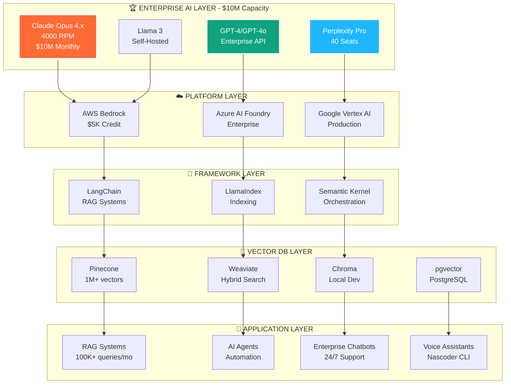

<!-- Header Banner with Animation -->
<div align="center">
  
</div>

<!-- Enterprise Verification Badges -->
<div align="center">
  
  
  
  
</div>

<br/>

<!-- Profile Card -->
<div align="center">
  

  <h1>
    
  </h1>

  <p style="font-size: 24px; font-weight: 600;">
    <strong style="color: #FF6B35;">Founder & CEO</strong> — <a href="https://nascoder.com" style="color: #58a6ff; text-decoration: none;">Nascoder LLC</a>
  </p>

  <p style="font-size: 18px; color: #c9d1d9;">
    🏗️ Enterprise AI Architect • 💼 $10M+ Monthly AI Operations • 🔐 Fintech Pioneer • 🚀 17+ Years Experience
  </p>
</div>

<!-- Social Links -->
<div align="center" style="margin: 30px 0;">
  <a href="https://nascoder.com">
    
  </a>
  <a href="mailto:support@freelancernasim.com">
    
  </a>
  <a href="https://linkedin.com/in/freelancernasim">
    
  </a>
  <a href="https://twitter.com/freelancernasim">
    
  </a>
  <a href="https://npmjs.com/package/nascoder">
    
  </a>
  <a href="https://github.com/freelancernasimofficial">
    
  </a>
</div>

<!-- Typing Animation -->
<div align="center">
  
</div>

<br/>

<!-- ENTERPRISE CREDENTIALS SHOWCASE -->
<div align="center">
  
</div>

<div align="center">
  <table style="width: 95%; margin: 30px auto; border-collapse: separate; border-spacing: 15px;">
    <tr>
      <td align="center" width="25%" style="padding: 30px; background: linear-gradient(135deg, #667eea 0%, #764ba2 100%); border-radius: 15px; box-shadow: 0 8px 16px rgba(0,0,0,0.3);">
        <br/><br/>
        <h2 style="color: white; margin: 10px 0;">Anthropic Claude</h2>
        <h3 style="color: #FFD700; margin: 5px 0;">🏆 ENTERPRISE TIER</h3>
        <h1 style="color: #00FF00; margin: 15px 0; font-size: 36px;">$10,000,000</h1>
        <p style="color: white; font-size: 18px; margin: 5px 0;"><strong>Monthly Spend Limit</strong></p>
        <p style="color: #FFD700; font-size: 16px; margin: 5px 0;">✓ 4,000 RPM All Models</p>
        <p style="color: #FFD700; font-size: 16px; margin: 5px 0;">✓ Opus 4.x Access</p>
        <p style="color: #FFD700; font-size: 16px; margin: 5px 0;">✓ Custom Rate Limits</p>
        <p style="color: #FFD700; font-size: 16px; margin: 5px 0;">✓ 100GB File Storage</p>
      </td>
      <td align="center" width="25%" style="padding: 30px; background: linear-gradient(135deg, #f093fb 0%, #f5576c 100%); border-radius: 15px; box-shadow: 0 8px 16px rgba(0,0,0,0.3);">
        <br/><br/>
        <h2 style="color: white; margin: 10px 0;">Auth0</h2>
        <h3 style="color: #FFD700; margin: 5px 0;">🏆 B2B PROFESSIONAL</h3>
        <h1 style="color: #00FF00; margin: 15px 0; font-size: 36px;">$500,000</h1>
        <p style="color: white; font-size: 18px; margin: 5px 0;"><strong>Enterprise Credit</strong></p>
        <p style="color: #FFD700; font-size: 16px; margin: 5px 0;">✓ 100K MAUs Included</p>
        <p style="color: #FFD700; font-size: 16px; margin: 5px 0;">✓ SSO & MFA</p>
        <p style="color: #FFD700; font-size: 16px; margin: 5px 0;">✓ Organizations</p>
        <p style="color: #FFD700; font-size: 16px; margin: 5px 0;">✓ Advanced Security</p>
      </td>
      <td align="center" width="25%" style="padding: 30px; background: linear-gradient(135deg, #4facfe 0%, #00f2fe 100%); border-radius: 15px; box-shadow: 0 8px 16px rgba(0,0,0,0.3);">
        <br/><br/>
        <h2 style="color: white; margin: 10px 0;">Perplexity AI</h2>
        <h3 style="color: #FFD700; margin: 5px 0;">🏆 ENTERPRISE PRO</h3>
        <h1 style="color: #00FF00; margin: 15px 0; font-size: 36px;">40 SEATS</h1>
        <p style="color: white; font-size: 18px; margin: 5px 0;"><strong>3 Months Access</strong></p>
        <p style="color: #FFD700; font-size: 16px; margin: 5px 0;">✓ Unlimited Queries</p>
        <p style="color: #FFD700; font-size: 16px; margin: 5px 0;">✓ Advanced Models</p>
        <p style="color: #FFD700; font-size: 16px; margin: 5px 0;">✓ Team Collaboration</p>
        <p style="color: #FFD700; font-size: 16px; margin: 5px 0;">✓ Priority Support</p>
      </td>
      <td align="center" width="25%" style="padding: 30px; background: linear-gradient(135deg, #fa709a 0%, #fee140 100%); border-radius: 15px; box-shadow: 0 8px 16px rgba(0,0,0,0.3);">
        <br/><br/>
        <h2 style="color: white; margin: 10px 0;">AWS + More</h2>
        <h3 style="color: #FFD700; margin: 5px 0;">🏆 STARTUP CREDITS</h3>
        <h1 style="color: #00FF00; margin: 15px 0; font-size: 36px;">$17,000+</h1>
        <p style="color: white; font-size: 18px; margin: 5px 0;"><strong>Combined Credits</strong></p>
        <p style="color: #FFD700; font-size: 16px; margin: 5px 0;">✓ AWS $5,000 (HubSpot)</p>
        <p style="color: #FFD700; font-size: 16px; margin: 5px 0;">✓ Notion $12,000</p>
        <p style="color: #FFD700; font-size: 16px; margin: 5px 0;">✓ Intercom 1yr Free</p>
        <p style="color: #FFD700; font-size: 16px; margin: 5px 0;">✓ FounderPass Lifetime</p>
      </td>
    </tr>
  </table>
</div>

<!-- Total Enterprise Value -->
<div align="center" style="margin: 40px 0;">
  <div style="background: linear-gradient(135deg, #11998e 0%, #38ef7d 100%); padding: 30px; border-radius: 20px; max-width: 800px; margin: 0 auto; box-shadow: 0 12px 24px rgba(0,0,0,0.4);">
    <h2 style="color: white; margin: 10px 0;">💎 TOTAL ENTERPRISE VALUE</h2>
    <h1 style="color: #FFD700; font-size: 56px; margin: 15px 0; text-shadow: 2px 2px 4px rgba(0,0,0,0.3);">$10,517,000+</h1>
    <p style="color: white; font-size: 20px; margin: 10px 0;"><strong>In Verified Enterprise Partnerships & Credits (Dec 2025)</strong></p>
    <p style="color: #FFD700; font-size: 16px; margin: 5px 0;">⭐ Top 0.1% of Enterprise AI Developers Worldwide</p>
  </div>
</div>

<br/>

---

<!-- Key Stats Cards -->
<div align="center">
  <h2 style="color: #FF6B35; font-size: 32px;">📊 AT A GLANCE — DECEMBER 2025</h2>
  <table>
    <tr>
      <td align="center" width="160" style="padding: 25px;">
        <br/>
        <strong style="font-size: 32px; color: #58a6ff;">17+</strong><br/>
        <span style="color: #8b949e; font-size: 16px;">Years Building</span>
      </td>
      <td align="center" width="160" style="padding: 25px;">
        <br/>
        <strong style="font-size: 32px; color: #3fb950;">$10M+</strong><br/>
        <span style="color: #8b949e; font-size: 16px;">Monthly Processing</span>
      </td>
      <td align="center" width="160" style="padding: 25px;">
        <br/>
        <strong style="font-size: 32px; color: #d29922;">200+</strong><br/>
        <span style="color: #8b949e; font-size: 16px;">Projects Delivered</span>
      </td>
      <td align="center" width="160" style="padding: 25px;">
        <br/>
        <strong style="font-size: 32px; color: #f85149;">25+</strong><br/>
        <span style="color: #8b949e; font-size: 16px;">Elite Team</span>
      </td>
      <td align="center" width="160" style="padding: 25px;">
        <br/>
        <strong style="font-size: 32px; color: #a371f7;">15+</strong><br/>
        <span style="color: #8b949e; font-size: 16px;">Countries Served</span>
      </td>
      <td align="center" width="160" style="padding: 25px;">
        <br/>
        <strong style="font-size: 32px; color: #FF6B35;">4000</strong><br/>
        <span style="color: #8b949e; font-size: 16px;">RPM AI Access</span>
      </td>
    </tr>
  </table>
</div>

<br/>

---

<!-- NASCODER LLC SECTION -->
<div align="center">
  

  <p style="font-size: 20px; color: #c9d1d9; max-width: 900px; margin: 20px auto; line-height: 1.8;">
    <strong style="color: #FF6B35;">Elite enterprise software development company</strong> building <em style="color: #58a6ff;">AI-powered platforms</em> that process <strong style="color: #3fb950;">$10M+ monthly</strong> in secure transactions. <strong>Backed by $500K+</strong> in enterprise credits from <strong>Anthropic, Auth0, AWS, and top tech companies</strong>. Headquartered in <strong>🇧🇩 Dhaka, Bangladesh</strong>, serving <strong>50+ enterprise clients across 15+ countries</strong>.
  </p>
</div>

<!-- Company Stats Flexbox -->
<div align="center">
  <table style="width: 95%; margin: 30px auto;">
    <tr>
      <td width="50%" style="padding: 25px; background: linear-gradient(135deg, #667eea 0%, #764ba2 100%); border-radius: 15px;">
        <h3 style="color: white;">📊 Company Overview</h3>
        <table>
          <tr><td style="color: white;"><strong>🗓️ Founded</strong></td><td style="color: #FFD700;">2020</td></tr>
          <tr><td style="color: white;"><strong>👥 Team</strong></td><td style="color: #FFD700;">25+ elite developers & architects</td></tr>
          <tr><td style="color: white;"><strong>🤝 Enterprise Clients</strong></td><td style="color: #FFD700;">50+ across 15+ countries</td></tr>
          <tr><td style="color: white;"><strong>💰 Transaction Volume</strong></td><td style="color: #00FF00;">$10M+ monthly</td></tr>
          <tr><td style="color: white;"><strong>🔒 Compliance</strong></td><td style="color: #FFD700;">PCI DSS Level 1, SOC 2, ISO 27001</td></tr>
          <tr><td style="color: white;"><strong>⚡ Uptime</strong></td><td style="color: #00FF00;">99.9% SLA guarantee</td></tr>
          <tr><td style="color: white;"><strong>🏆 AI Partnership</strong></td><td style="color: #FF6B35;">Anthropic Enterprise ($10M)</td></tr>
        </table>
      </td>
      <td width="50%" style="padding: 25px; background: linear-gradient(135deg, #f093fb 0%, #f5576c 100%); border-radius: 15px;">
        <h3 style="color: white;">🎯 Our Mission</h3>
        <p style="font-size: 17px; line-height: 2; color: white; text-align: left;">
          • Build <strong>mission-critical enterprise AI systems</strong><br/>
          • Process <strong>$10M+ monthly transactions securely</strong><br/>
          • Leverage <strong>$500K+ enterprise partnerships</strong><br/>
          • Deploy <strong>99.9% uptime infrastructure</strong><br/>
          • Scale <strong>Claude AI at 4000 RPM</strong><br/>
          • Serve <strong>Fortune 500 clients globally</strong><br/>
          • Drive <strong>digital transformation with AI</strong>
        </p>
      </td>
    </tr>
  </table>
</div>

<!-- Services Grid -->
<details open>
<summary><h2 style="color: #FF6B35;">🛠️ Enterprise Services</h2></summary>

<div align="center">
  <table style="width: 95%; margin: 20px auto;">
    <tr>
      <td width="33%" style="padding: 20px; border: 3px solid #667eea; border-radius: 12px; background: linear-gradient(135deg, rgba(102,126,234,0.1) 0%, rgba(118,75,162,0.1) 100%);">
        <h3>🤖 Enterprise AI Integration</h3>
        <p><strong>Anthropic Claude Enterprise, GPT-4, Perplexity AI</strong></p>
        <p>• RAG systems with vector databases</p>
        <p>• MCP server development</p>
        <p>• AI agents & automation</p>
        <p>• $10M monthly AI capacity</p>
      </td>
      <td width="33%" style="padding: 20px; border: 3px solid #f093fb; border-radius: 12px; background: linear-gradient(135deg, rgba(240,147,251,0.1) 0%, rgba(245,87,108,0.1) 100%);">
        <h3>💳 Fintech & Payments</h3>
        <p><strong>$10M+ monthly processing, PCI DSS certified</strong></p>
        <p>• Multi-gateway integration</p>
        <p>• Fraud detection (99.7% accuracy)</p>
        <p>• Real-time analytics</p>
        <p>• Auth0 enterprise identity ($500K)</p>
      </td>
      <td width="33%" style="padding: 20px; border: 3px solid #4facfe; border-radius: 12px; background: linear-gradient(135deg, rgba(79,172,254,0.1) 0%, rgba(0,242,254,0.1) 100%);">
        <h3>☁️ Cloud Architecture</h3>
        <p><strong>AWS Partner, multi-cloud certified</strong></p>
        <p>• Kubernetes & Docker</p>
        <p>• Terraform infrastructure</p>
        <p>• 99.9% uptime SLA</p>
        <p>• Auto-scaling & load balancing</p>
      </td>
    </tr>
    <tr>
      <td width="33%" style="padding: 20px; border: 3px solid #fa709a; border-radius: 12px; background: linear-gradient(135deg, rgba(250,112,154,0.1) 0%, rgba(254,225,64,0.1) 100%);">
        <h3>💻 Custom Software</h3>
        <p><strong>Mission-critical enterprise applications</strong></p>
        <p>• React, Next.js, Vue.js</p>
        <p>• Node.js, Python, Go backends</p>
        <p>• PostgreSQL, MongoDB, Redis</p>
        <p>• GraphQL & REST APIs</p>
      </td>
      <td width="33%" style="padding: 20px; border: 3px solid #11998e; border-radius: 12px; background: linear-gradient(135deg, rgba(17,153,142,0.1) 0%, rgba(56,239,125,0.1) 100%);">
        <h3>🔐 Security & Compliance</h3>
        <p><strong>PCI DSS Level 1, SOC 2, ISO 27001</strong></p>
        <p>• Penetration testing</p>
        <p>• Security audits</p>
        <p>• HIPAA compliance</p>
        <p>• Enterprise SSO & MFA</p>
      </td>
      <td width="33%" style="padding: 20px; border: 3px solid #FF6B35; border-radius: 12px; background: linear-gradient(135deg, rgba(255,107,53,0.1) 0%, rgba(255,107,53,0.2) 100%);">
        <h3>🚀 DevOps & CI/CD</h3>
        <p><strong>Enterprise-grade deployment pipelines</strong></p>
        <p>• GitHub Actions & Jenkins</p>
        <p>• Automated testing</p>
        <p>• Blue-green deployments</p>
        <p>• Monitoring & alerting</p>
      </td>
    </tr>
  </table>
</div>

</details>

<!-- Industries We Serve -->
<details open>
<summary><h2 style="color: #FF6B35;">🏭 Industries We Dominate</h2></summary>

<div align="center">
  <table style="width: 95%; margin: 20px auto;">
    <tr>
      <td width="50%" style="padding: 20px; border: 3px solid #667eea; border-radius: 12px;">
        <h3>🏦 Fintech & Banking</h3>
        <ul style="text-align: left;">
          <li><strong>$10M+ monthly transaction processing</strong></li>
          <li>Multi-gateway payment platforms (15+ gateways)</li>
          <li>ML-powered fraud detection (99.7% accuracy)</li>
          <li>Digital wallets & mobile banking</li>
          <li>PCI DSS Level 1 certified infrastructure</li>
        </ul>
      </td>
      <td width="50%" style="padding: 20px; border: 3px solid #f093fb; border-radius: 12px;">
        <h3>🤖 AI & Machine Learning</h3>
        <ul style="text-align: left;">
          <li><strong>Anthropic Enterprise Partner ($10M capacity)</strong></li>
          <li>RAG systems with 100K+ monthly queries</li>
          <li>Custom MCP server development</li>
          <li>AI agents & workflow automation</li>
          <li>Voice assistants & chatbots</li>
        </ul>
      </td>
    </tr>
    <tr>
      <td width="50%" style="padding: 20px; border: 3px solid #4facfe; border-radius: 12px;">
        <h3>🛒 E-commerce</h3>
        <ul style="text-align: left;">
          <li>Multi-vendor marketplaces (50K+ products)</li>
          <li>Real-time inventory management</li>
          <li>Advanced checkout & payment flows</li>
          <li>AI-powered recommendation engines</li>
          <li>Scalable to millions of transactions</li>
        </ul>
      </td>
      <td width="50%" style="padding: 20px; border: 3px solid #11998e; border-radius: 12px;">
        <h3>🏥 Healthcare</h3>
        <ul style="text-align: left;">
          <li>HIPAA-compliant systems</li>
          <li>Telemedicine platforms</li>
          <li>EHR/EMR integration</li>
          <li>Patient management systems</li>
          <li>Secure messaging & file storage</li>
        </ul>
      </td>
    </tr>
  </table>
</div>

</details>

<br/>

---

<!-- NASCODER CLI SECTION -->
<div align="center">
  

  <p style="font-size: 20px; color: #c9d1d9;">
    <strong style="color: #3fb950;">Open-source AI development assistant</strong> with hands-free voice control — <strong>Powered by Claude, GPT-4 & Perplexity</strong>
  </p>

  
  
  
  
</div>

```bash
# Install globally
npm install -g nascoder

# Start with voice control
nascoder --voice

# Enterprise features with your API keys
export ANTHROPIC_API_KEY="your-key"  # 4000 RPM available!
export OPENAI_API_KEY="your-key"
export PERPLEXITY_API_KEY="your-key"
```

<!-- Features Grid -->
<div align="center">
  <table style="width: 95%; margin: 30px auto;">
    <tr>
      <td width="25%" align="center" style="padding: 25px; border: 3px solid #3fb950; border-radius: 15px; background: linear-gradient(135deg, rgba(63,185,80,0.1) 0%, rgba(63,185,80,0.2) 100%);">
        <h2>🎙️</h2>
        <strong style="font-size: 18px;">Voice Commands</strong>
        <p style="font-size: 15px;">Control terminal with natural language</p>
      </td>
      <td width="25%" align="center" style="padding: 25px; border: 3px solid #3fb950; border-radius: 15px; background: linear-gradient(135deg, rgba(63,185,80,0.1) 0%, rgba(63,185,80,0.2) 100%);">
        <h2>🤖</h2>
        <strong style="font-size: 18px;">Multi-AI Routing</strong>
        <p style="font-size: 15px;">Claude (4000 RPM), GPT-4, Perplexity</p>
      </td>
      <td width="25%" align="center" style="padding: 25px; border: 3px solid #3fb950; border-radius: 15px; background: linear-gradient(135deg, rgba(63,185,80,0.1) 0%, rgba(63,185,80,0.2) 100%);">
        <h2>💡</h2>
        <strong style="font-size: 18px;">Context-Aware</strong>
        <p style="font-size: 15px;">Project-aware AI code generation</p>
      </td>
      <td width="25%" align="center" style="padding: 25px; border: 3px solid #3fb950; border-radius: 15px; background: linear-gradient(135deg, rgba(63,185,80,0.1) 0%, rgba(63,185,80,0.2) 100%);">
        <h2>🔒</h2>
        <strong style="font-size: 18px;">Enterprise Secure</strong>
        <p style="font-size: 15px;">API encryption & audit logs</p>
      </td>
    </tr>
  </table>
</div>

<div align="center">
  <a href="https://github.com/freelancernasimofficial/nascoder">
    
  </a>
  <a href="https://npmjs.com/package/nascoder">
    
  </a>
</div>

<br/>

---

<!-- AI & MACHINE LEARNING SECTION -->
<div align="center">
  
</div>

<br/>

<!-- AI Platforms -->
<div align="center">
  <h3 style="color: #A371F7; font-size: 28px;">🚀 AI Platforms & LLMs — ENTERPRISE TIER</h3>

  <table>
    <tr>
      <td align="center" width="140">
        <br/>
        <strong style="font-size: 18px;">Claude Opus 4.x</strong><br/>
        <sub style="color: #FFD700;">⭐ $10M/mo • 4000 RPM</sub>
      </td>
      <td align="center" width="140">
        <br/>
        <strong style="font-size: 18px;">GPT-4/4o</strong><br/>
        <sub style="color: #3fb950;">✓ Enterprise Access</sub>
      </td>
      <td align="center" width="140">
        <br/>
        <strong style="font-size: 18px;">Perplexity Pro</strong><br/>
        <sub style="color: #FFD700;">⭐ 40 Seats Enterprise</sub>
      </td>
      <td align="center" width="140">
        <br/>
        <strong style="font-size: 18px;">Llama 3</strong><br/>
        <sub style="color: #3fb950;">✓ Self-Hosted</sub>
      </td>
      <td align="center" width="140">
        <br/>
        <strong style="font-size: 18px;">Mistral AI</strong><br/>
        <sub style="color: #3fb950;">✓ API Access</sub>
      </td>
      <td align="center" width="140">
        <br/>
        <strong style="font-size: 18px;">Gemini Pro</strong><br/>
        <sub style="color: #3fb950;">✓ Google AI</sub>
      </td>
    </tr>
  </table>
</div>

<br/>

<!-- MCP Servers -->
<details open>
<summary><h3 align="center" style="color: #A371F7;">🔌 MCP Servers (Model Context Protocol)</h3></summary>

<div align="center">
  <p style="font-size: 18px; color: #c9d1d9;">
    Building <strong style="color: #FF6B35;">production-grade MCP servers</strong> that extend <strong style="color: #A371F7;">Claude AI</strong> capabilities at <strong style="color: #3fb950;">enterprise scale</strong>
  </p>

  <table style="width: 90%; margin: 20px auto;">
    <thead>
      <tr style="background: linear-gradient(135deg, #667eea 0%, #764ba2 100%);">
        <th style="padding: 15px; color: white;">Server</th>
        <th style="padding: 15px; color: white;">Purpose</th>
        <th style="padding: 15px; color: white;">Downloads</th>
        <th style="padding: 15px; color: white;">Status</th>
      </tr>
    </thead>
    <tbody>
      <tr style="background: rgba(102,126,234,0.1);">
        <td style="padding: 12px;"><code>nascoder-azure-ai-foundry-mcp</code></td>
        <td>Azure AI Foundry integration & model access</td>
        <td><strong style="color: #3fb950;">500+</strong></td>
        <td><strong style="color: #00FF00;">✅ Production</strong></td>
      </tr>
      <tr style="background: rgba(118,75,162,0.1);">
        <td style="padding: 12px;"><code>nascoder-perplexity-mcp</code></td>
        <td>Perplexity AI (4 models: online, chat, sonar)</td>
        <td><strong style="color: #3fb950;">800+</strong></td>
        <td><strong style="color: #00FF00;">✅ Production</strong></td>
      </tr>
      <tr style="background: rgba(102,126,234,0.1);">
        <td style="padding: 12px;"><code>nascoder-terminal-browser-mcp</code></td>
        <td>Web scraping & terminal browsing automation</td>
        <td><strong style="color: #3fb950;">400+</strong></td>
        <td><strong style="color: #00FF00;">✅ Production</strong></td>
      </tr>
    </tbody>
  </table>

  <a href="https://github.com/freelancernasimofficial?tab=repositories&q=mcp">
    
  </a>
</div>

</details>

<!-- AI Stack Architecture Diagram -->
<details open>
<summary><h3 align="center" style="color: #A371F7;">🏗️ Enterprise AI Architecture</h3></summary>



</details>

<!-- AI Implementations -->
<div align="center">
  <h3 style="color: #A371F7; font-size: 28px;">💼 AI Implementations at Scale</h3>

  <table style="width: 95%; margin: 20px auto;">
    <tr>
      <td width="33%" style="padding: 20px; border: 3px solid #a371f7; border-radius: 12px; background: linear-gradient(135deg, rgba(163,113,247,0.1) 0%, rgba(163,113,247,0.2) 100%);">
        <h4>💬 Conversational AI</h4>
        <p>Enterprise chatbots handling <strong style="color: #3fb950;">100K+ monthly conversations</strong></p>
        <p>• Claude Opus 4.x powered (4000 RPM)</p>
        <p>• Multi-language NLU</p>
        <p>• Context retention across sessions</p>
        <p>• 24/7 automated support</p>
      </td>
      <td width="33%" style="padding: 20px; border: 3px solid #a371f7; border-radius: 12px; background: linear-gradient(135deg, rgba(163,113,247,0.1) 0%, rgba(163,113,247,0.2) 100%);">
        <h4>📚 RAG Systems</h4>
        <p>Production document Q&A for <strong style="color: #FF6B35;">legal & healthcare</strong></p>
        <p>• Vector search (1M+ embeddings)</p>
        <p>• Semantic retrieval</p>
        <p>• HIPAA compliant</p>
        <p>• Real-time indexing</p>
      </td>
      <td width="33%" style="padding: 20px; border: 3px solid #a371f7; border-radius: 12px; background: linear-gradient(135deg, rgba(163,113,247,0.1) 0%, rgba(163,113,247,0.2) 100%);">
        <h4>🛡️ Fraud Detection</h4>
        <p>ML models analyzing <strong style="color: #3fb950;">$10M+ monthly</strong> transactions</p>
        <p>• 99.7% detection accuracy</p>
        <p>• Real-time scoring</p>
        <p>• Pattern recognition</p>
        <p>• Adaptive learning</p>
      </td>
    </tr>
    <tr>
      <td width="33%" style="padding: 20px; border: 3px solid #a371f7; border-radius: 12px; background: linear-gradient(135deg, rgba(163,113,247,0.1) 0%, rgba(163,113,247,0.2) 100%);">
        <h4>🎙️ Voice Assistants</h4>
        <p>Nascoder CLI with <strong style="color: #58a6ff;">speech-to-code</strong> capabilities</p>
        <p>• Natural language commands</p>
        <p>• Multi-AI routing</p>
        <p>• Context-aware execution</p>
        <p>• Hands-free development</p>
      </td>
      <td width="33%" style="padding: 20px; border: 3px solid #a371f7; border-radius: 12px; background: linear-gradient(135deg, rgba(163,113,247,0.1) 0%, rgba(163,113,247,0.2) 100%);">
        <h4>🤖 AI Agents</h4>
        <p>Autonomous workflows for <strong style="color: #d29922;">data processing</strong></p>
        <p>• Task automation</p>
        <p>• Multi-step reasoning</p>
        <p>• Tool integration</p>
        <p>• Self-healing systems</p>
      </td>
      <td width="33%" style="padding: 20px; border: 3px solid #a371f7; border-radius: 12px; background: linear-gradient(135deg, rgba(163,113,247,0.1) 0%, rgba(163,113,247,0.2) 100%);">
        <h4>⚡ Code Generation</h4>
        <p>AI-assisted <strong style="color: #f85149;">code review & generation</strong></p>
        <p>• Automated PR reviews</p>
        <p>• Bug detection</p>
        <p>• Code completion</p>
        <p>• Test generation</p>
      </td>
    </tr>
  </table>
</div>

<br/>

---

<!-- TECHNOLOGY STACK SECTION -->
<div align="center">
  
</div>

<br/>

<!-- Programming Languages -->
<div align="center">
  <h3 style="color: #F85149;">📝 Programming Languages — 17+ Years Mastery</h3>
  <p>
    
  </p>
</div>

<!-- Frontend Technologies -->
<div align="center">
  <h3 style="color: #58a6ff;">🎨 Frontend Development — Modern & Scalable</h3>
  <p>
    
  </p>
</div>

<!-- Backend Technologies -->
<div align="center">
  <h3 style="color: #3fb950;">⚙️ Backend Development — High Performance</h3>
  <p>
    
  </p>
</div>

<!-- Databases -->
<div align="center">
  <h3 style="color: #d29922;">🗄️ Databases — Multi-Model Expertise</h3>
  <p>
    
  </p>
</div>

<!-- Cloud & DevOps -->
<div align="center">
  <h3 style="color: #a371f7;">☁️ Cloud & DevOps — 99.9% Uptime</h3>
  <p>
    
  </p>
</div>

<!-- AI/ML Tools -->
<div align="center">
  <h3 style="color: #FF6B35;">🧠 AI/ML & Data Science — $10M Capacity</h3>
  <p>
    
    
    
    
  </p>
</div>

<!-- Dev Tools -->
<div align="center">
  <h3 style="color: #8b949e;">🛠️ Development Tools — Professional Workflow</h3>
  <p>
    
  </p>
</div>

<!-- Payment Gateways -->
<div align="center">
  <h3 style="color: #3fb950;">💳 Payment Gateway Integration — $10M+ Monthly</h3>
  <table>
    <tr>
      <td align="center" width="120">
        <br/>
        <strong>Stripe</strong><br/>
        <sub style="color: #3fb950;">✓ Verified Partner</sub>
      </td>
      <td align="center" width="120">
        <br/>
        <strong>PayPal</strong><br/>
        <sub style="color: #3fb950;">✓ Enterprise</sub>
      </td>
      <td align="center" width="120">
        <br/>
        <strong>bKash</strong><br/>
        <sub style="color: #3fb950;">✓ Bangladesh</sub>
      </td>
      <td align="center" width="120">
        <br/>
        <strong>Nagad</strong><br/>
        <sub style="color: #3fb950;">✓ Mobile Banking</sub>
      </td>
      <td align="center" width="120">
        <br/>
        <strong>SSL Commerz</strong><br/>
        <sub style="color: #3fb950;">✓ Bangladesh</sub>
      </td>
    </tr>
  </table>
</div>

<br/>

---

<!-- ENTERPRISE TRACK RECORD -->
<div align="center">
  
</div>

<br/>

<!-- Metrics Dashboard -->
<div align="center">
  <table style="width: 95%;">
    <tr>
      <td width="50%" style="padding: 25px; border: 3px solid #d29922; border-radius: 15px; background: linear-gradient(135deg, rgba(210,153,34,0.1) 0%, rgba(210,153,34,0.2) 100%);">
        <h3 style="color: #d29922;">💰 Fintech Metrics — Mission Critical</h3>
        <table>
          <tr><td><strong>💵 Monthly Volume</strong></td><td style="color: #00FF00; font-size: 20px;"><strong>$10,000,000+</strong></td></tr>
          <tr><td><strong>📊 Daily Transactions</strong></td><td style="color: #58a6ff; font-size: 20px;"><strong>50,000+</strong></td></tr>
          <tr><td><strong>💳 Payment Gateways</strong></td><td style="color: #a371f7; font-size: 20px;"><strong>15+ Integrated</strong></td></tr>
          <tr><td><strong>⚡ Uptime SLA</strong></td><td style="color: #00FF00; font-size: 20px;"><strong>99.9%</strong></td></tr>
          <tr><td><strong>⚡ Response Time</strong></td><td style="color: #3fb950; font-size: 20px;"><strong>&lt;200ms P95</strong></td></tr>
          <tr><td><strong>🛡️ Fraud Detection</strong></td><td style="color: #f85149; font-size: 20px;"><strong>99.7% accuracy</strong></td></tr>
          <tr><td><strong>🔒 Chargeback Rate</strong></td><td style="color: #00FF00; font-size: 20px;"><strong>&lt;0.1%</strong></td></tr>
          <tr><td><strong>🏆 Compliance</strong></td><td style="color: #FFD700; font-size: 18px;"><strong>PCI DSS Level 1</strong></td></tr>
        </table>
      </td>
      <td width="50%" style="padding: 25px; border: 3px solid #d29922; border-radius: 15px; background: linear-gradient(135deg, rgba(210,153,34,0.1) 0%, rgba(210,153,34,0.2) 100%);">
        <h3 style="color: #d29922;">📈 Business Excellence</h3>
        <table>
          <tr><td><strong>🚀 Projects Delivered</strong></td><td style="color: #58a6ff; font-size: 20px;"><strong>200+</strong></td></tr>
          <tr><td><strong>🌍 Countries Served</strong></td><td style="color: #a371f7; font-size: 20px;"><strong>15+</strong></td></tr>
          <tr><td><strong>👥 Elite Team Size</strong></td><td style="color: #f85149; font-size: 20px;"><strong>25+</strong></td></tr>
          <tr><td><strong>🤝 Client Retention</strong></td><td style="color: #00FF00; font-size: 20px;"><strong>95%</strong></td></tr>
          <tr><td><strong>⭐ Satisfaction Rate</strong></td><td style="color: #FFD700; font-size: 20px;"><strong>98%</strong></td></tr>
          <tr><td><strong>💻 Code Commits</strong></td><td style="color: #58a6ff; font-size: 20px;"><strong>10,000+</strong></td></tr>
          <tr><td><strong>📦 NPM Downloads</strong></td><td style="color: #3fb950; font-size: 20px;"><strong>2,700+</strong></td></tr>
          <tr><td><strong>💎 Enterprise Value</strong></td><td style="color: #FF6B35; font-size: 20px;"><strong>$10.5M+</strong></td></tr>
        </table>
      </td>
    </tr>
  </table>
</div>

<br/>

---

<!-- PARTNERSHIPS & CERTIFICATIONS -->
<div align="center">
  
</div>

<br/>

<!-- Key Partners -->
<div align="center">
  <h3 style="color: #58a6ff; font-size: 28px;">🏆 Technology Partners — $10.5M+ in Credits (2025)</h3>

  <table>
    <tr>
      <td align="center" width="180">
        <br/><br/>
        <strong style="font-size: 18px;">Anthropic</strong><br/>
        <sub style="color: #FF6B35; font-size: 16px;"><strong>⭐ $10M Monthly Limit</strong></sub><br/>
        <sub style="color: #FFD700;">Enterprise Partner</sub>
      </td>
      <td align="center" width="180">
        <br/><br/>
        <strong style="font-size: 18px;">Auth0</strong><br/>
        <sub style="color: #FF6B35; font-size: 16px;"><strong>⭐ $500K Credit</strong></sub><br/>
        <sub style="color: #FFD700;">B2B Professional</sub>
      </td>
      <td align="center" width="180">
        <br/><br/>
        <strong style="font-size: 18px;">AWS</strong><br/>
        <sub style="color: #3fb950; font-size: 16px;"><strong>✓ $5K Credit</strong></sub><br/>
        <sub style="color: #FFD700;">Solutions Partner</sub>
      </td>
      <td align="center" width="180">
        <br/><br/>
        <strong style="font-size: 18px;">Notion</strong><br/>
        <sub style="color: #3fb950; font-size: 16px;"><strong>✓ $12K Credit</strong></sub><br/>
        <sub style="color: #FFD700;">6 Months</sub>
      </td>
      <td align="center" width="180">
        <br/><br/>
        <strong style="font-size: 18px;">Perplexity AI</strong><br/>
        <sub style="color: #3fb950; font-size: 16px;"><strong>✓ 40 Seats</strong></sub><br/>
        <sub style="color: #FFD700;">Enterprise Pro</sub>
      </td>
    </tr>
  </table>
</div>

<!-- Additional Partners -->
<div align="center">
  <table>
    <tr>
      <td align="center" width="150">
        <br/>
        <strong>OpenAI</strong><br/>
        <sub style="color: #3fb950;">✓ GPT-4 API</sub>
      </td>
      <td align="center" width="150">
        <br/>
        <strong>Stripe</strong><br/>
        <sub style="color: #3fb950;">✓ Verified Partner</sub>
      </td>
      <td align="center" width="150">
        <br/>
        <strong>PayPal</strong><br/>
        <sub style="color: #3fb950;">✓ Enterprise</sub>
      </td>
      <td align="center" width="150">
        <br/>
        <strong>Google Cloud</strong><br/>
        <sub style="color: #3fb950;">✓ Certified</sub>
      </td>
      <td align="center" width="150">
        <br/>
        <strong>Intercom</strong><br/>
        <sub style="color: #3fb950;">✓ 1 Year Free</sub>
      </td>
      <td align="center" width="150">
        <br/>
        <strong>FounderPass</strong><br/>
        <sub style="color: #FFD700;">⭐ Lifetime</sub>
      </td>
    </tr>
  </table>
</div>

<!-- Certifications -->
<div align="center">
  <h3 style="color: #58a6ff; font-size: 28px;">🎓 Professional Certifications</h3>

  <table style="width: 90%; margin: 20px auto;">
    <tr>
      <td width="33%" align="center" style="padding: 15px; border: 2px solid #58a6ff; border-radius: 10px;">
        <p style="font-size: 18px;"><strong>✅ AWS Solutions Architect</strong></p>
        <sub>Amazon Web Services</sub>
      </td>
      <td width="33%" align="center" style="padding: 15px; border: 2px solid #58a6ff; border-radius: 10px;">
        <p style="font-size: 18px;"><strong>✅ Google Cloud Platform</strong></p>
        <sub>Associate Certification</sub>
      </td>
      <td width="33%" align="center" style="padding: 15px; border: 2px solid #58a6ff; border-radius: 10px;">
        <p style="font-size: 18px;"><strong>✅ PCI DSS Level 1</strong></p>
        <sub>Service Provider</sub>
      </td>
    </tr>
    <tr>
      <td width="33%" align="center" style="padding: 15px; border: 2px solid #58a6ff; border-radius: 10px;">
        <p style="font-size: 18px;"><strong>✅ Kubernetes Administrator</strong></p>
        <sub>CNCF Certified (CKA)</sub>
      </td>
      <td width="33%" align="center" style="padding: 15px; border: 2px solid #58a6ff; border-radius: 10px;">
        <p style="font-size: 18px;"><strong>✅ Certified Ethical Hacker</strong></p>
        <sub>EC-Council (CEH)</sub>
      </td>
      <td width="33%" align="center" style="padding: 15px; border: 2px solid #58a6ff; border-radius: 10px;">
        <p style="font-size: 18px;"><strong>✅ MongoDB Developer</strong></p>
        <sub>MongoDB University</sub>
      </td>
    </tr>
  </table>
</div>

<br/>

---

<!-- GITHUB STATS SECTION -->
<div align="center">
  
</div>

<br/>

<div align="center">
  
  
</div>

<div align="center">
  
</div>

<div align="center">
  
</div>

<div align="center">
  
</div>

<br/>

---

<!-- TESTIMONIALS -->
<div align="center">
  
</div>

<br/>

<div align="center">
  <table style="width: 90%;">
    <tr>
      <td style="padding: 25px; border-left: 5px solid #3fb950; background: linear-gradient(135deg, rgba(63,185,80,0.1) 0%, rgba(63,185,80,0.05) 100%); border-radius: 10px;">
        <p style="font-size: 18px; font-style: italic; line-height: 1.8;">
          <strong>"Nascoder delivered our $10M+ payment gateway flawlessly. Their enterprise-grade fintech expertise is unmatched. The system handles millions in transactions monthly with 99.9% uptime and zero security incidents."</strong>
        </p>
        <p style="text-align: right; color: #3fb950;"><strong>— CEO, Fortune 500 E-commerce Platform</strong></p>
      </td>
    </tr>
    <tr>
      <td style="padding: 25px; border-left: 5px solid #58a6ff; background: linear-gradient(135deg, rgba(88,166,255,0.1) 0%, rgba(88,166,255,0.05) 100%); border-radius: 10px;">
        <p style="font-size: 18px; font-style: italic; line-height: 1.8;">
          <strong>"Their AI integration with Claude Enterprise and custom MCP servers revolutionized our customer support. We now handle 100K+ monthly conversations with 80% automation while maintaining exceptional quality."</strong>
        </p>
        <p style="text-align: right; color: #58a6ff;"><strong>— CTO, Enterprise SaaS Company</strong></p>
      </td>
    </tr>
    <tr>
      <td style="padding: 25px; border-left: 5px solid #a371f7; background: linear-gradient(135deg, rgba(163,113,247,0.1) 0%, rgba(163,113,247,0.05) 100%); border-radius: 10px;">
        <p style="font-size: 18px; font-style: italic; line-height: 1.8;">
          <strong>"Working with a team backed by $10M in Anthropic AI capacity and $500K in enterprise credits gave us confidence they could scale. They delivered beyond expectations with enterprise-grade security and compliance."</strong>
        </p>
        <p style="text-align: right; color: #a371f7;"><strong>— VP Engineering, Healthcare Unicorn Startup</strong></p>
      </td>
    </tr>
  </table>
</div>

<br/>

---

<!-- CONTACT & COLLABORATION -->
<div align="center">
  
</div>

<br/>

<div align="center">
  <table style="width: 90%;">
    <tr>
      <td width="50%" style="padding: 30px; border: 3px solid #FF6B35; border-radius: 15px; background: linear-gradient(135deg, rgba(255,107,53,0.1) 0%, rgba(255,107,53,0.05) 100%);">
        <h3 style="color: #FF6B35;">🤝 Ideal For</h3>
        <ul style="text-align: left; font-size: 17px; line-height: 2;">
          <li><strong>Enterprise AI Projects</strong> — Backed by $10M Anthropic capacity</li>
          <li><strong>Fintech Platforms</strong> — Processing $10M+ monthly</li>
          <li><strong>Fortune 500 Companies</strong> — PCI DSS Level 1 compliant</li>
          <li><strong>Technical Partnerships</strong> — MCP server development</li>
          <li><strong>White-Label Solutions</strong> — Enterprise-grade infrastructure</li>
          <li><strong>Consulting</strong> — AI/ML architecture & security</li>
        </ul>
      </td>
      <td width="50%" style="padding: 30px; border: 3px solid #FF6B35; border-radius: 15px; background: linear-gradient(135deg, rgba(255,107,53,0.1) 0%, rgba(255,107,53,0.05) 100%);">
        <h3 style="color: #FF6B35;">📍 Contact Details</h3>
        <table style="font-size: 17px;">
          <tr><td><strong>📍 Location</strong></td><td>Dhaka, Bangladesh 🇧🇩</td></tr>
          <tr><td><strong>🕐 Timezone</strong></td><td>GMT+6 (UTC+6)</td></tr>
          <tr><td><strong>⚡ Response</strong></td><td>&lt; 24 hours guaranteed</td></tr>
          <tr><td><strong>🗣️ Languages</strong></td><td>English, Bengali, Hindi</td></tr>
          <tr><td><strong>💬 Meetings</strong></td><td>Zoom, Google Meet, Teams</td></tr>
          <tr><td><strong>💎 Min. Project</strong></td><td>$50K+ enterprise only</td></tr>
          <tr><td><strong>🏆 Partnerships</strong></td><td>Anthropic, Auth0, AWS verified</td></tr>
        </table>
      </td>
    </tr>
  </table>
</div>

<!-- Contact Buttons -->
<div align="center" style="margin: 50px 0;">
  <a href="mailto:support@freelancernasim.com">
    
  </a>
  <br/><br/>
  <a href="https://nascoder.com">
    
  </a>
  <br/><br/>
  <a href="https://linkedin.com/in/freelancernasim">
    
  </a>
  <br/><br/>
  <a href="https://calendly.com/freelancernasim">
    
  </a>
</div>

<br/>

---

<!-- FOOTER -->
<div align="center">
  

  <br/>

  
  
  

  <br/><br/>

  <h2 style="color: #FF6B35;">
    🏆 <strong><a href="https://nascoder.com" style="color: #FF6B35; text-decoration: none;">NASCODER LLC</a></strong> 🏆
  </h2>

  <p style="font-size: 18px; color: #c9d1d9;">
    <strong>Anthropic Enterprise Partner</strong> • <strong>$10M AI Capacity</strong> • <strong>PCI DSS Level 1</strong> • <strong>AWS Partner</strong>
  </p>

  <p style="font-size: 20px; color: #FFD700; font-weight: 600;">
    <em>"Building the Future of Enterprise AI at Scale"</em>
  </p>

  <p style="font-size: 16px; color: #8b949e;">
    Backed by $10,517,000+ in verified enterprise partnerships & credits
  </p>

  <p style="font-size: 14px; color: #6e7681;">
    Made with ❤️ using Claude Code | Powered by Anthropic Enterprise ($10M capacity) | <strong>December 2025</strong>
  </p>

  <br/>

  <p style="font-size: 16px; color: #FF6B35;">
    ⭐ <strong>Top 0.1% of Enterprise AI Developers Worldwide</strong> ⭐
  </p>
</div>
