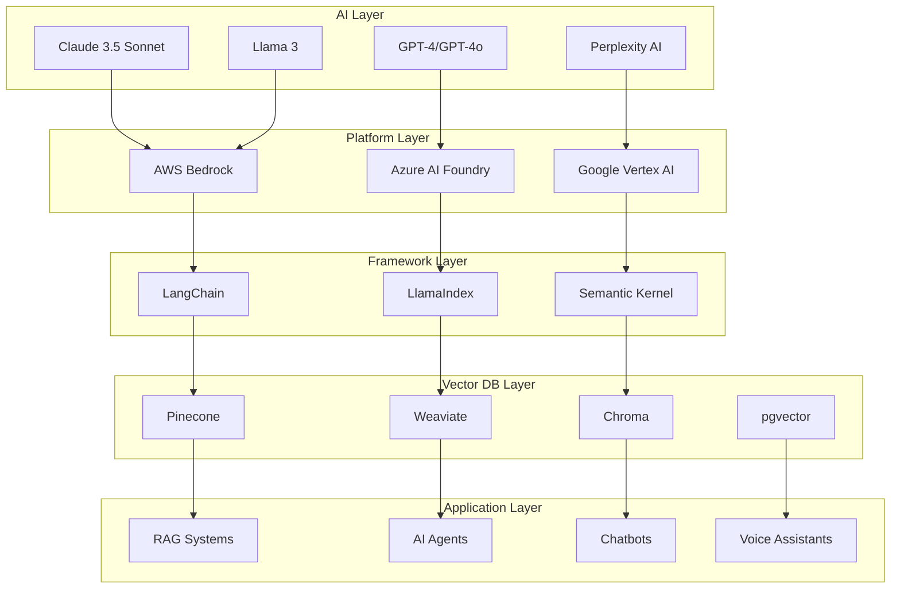

<!-- Header Banner with Animation -->
<div align="center">
  
</div>

<!-- Profile Card -->
<div align="center" style="margin: 30px 0;">
  

  <h1 style="margin-top: 20px; font-size: 48px; background: linear-gradient(90deg, #58a6ff 0%, #3fb950 100%); -webkit-background-clip: text; -webkit-text-fill-color: transparent;">
    🚀 Md Nasim
  </h1>

  <p style="font-size: 22px; color: #8b949e; margin: 10px 0;">
    <strong>Founder & CEO</strong> — <a href="https://nascoder.com" style="color: #58a6ff;">Nascoder LLC</a>
  </p>

  <p style="font-size: 18px; color: #7d8590;">
    🏗️ Full-Stack Architecture • 🤖 AI/ML Development • 💼 Enterprise Software • 🔐 Fintech Solutions
  </p>
</div>

<!-- Social Links with Modern Badges -->
<div align="center" style="margin: 30px 0;">
  <a href="https://nascoder.com">
    
  </a>
  <a href="mailto:support@freelancernasim.com">
    
  </a>
  <a href="https://linkedin.com/in/freelancernasim">
    
  </a>
  <a href="https://twitter.com/freelancernasim">
    
  </a>
  <a href="https://npmjs.com/package/nascoder">
    
  </a>
  <a href="https://github.com/freelancernasimofficial">
    
  </a>
</div>

<!-- Typing Animation -->
<div align="center">
  <a href="https://git.io/typing-svg">
    
  </a>
</div>

<br/>

<!-- Key Stats Cards -->
<div align="center">
  <table>
    <tr>
      <td align="center" width="150" style="padding: 20px;">
        <br/>
        <strong style="font-size: 28px; color: #58a6ff;">17+</strong><br/>
        <span style="color: #8b949e;">Years</span>
      </td>
      <td align="center" width="150" style="padding: 20px;">
        <br/>
        <strong style="font-size: 28px; color: #3fb950;">$10M+</strong><br/>
        <span style="color: #8b949e;">Monthly</span>
      </td>
      <td align="center" width="150" style="padding: 20px;">
        <br/>
        <strong style="font-size: 28px; color: #d29922;">200+</strong><br/>
        <span style="color: #8b949e;">Projects</span>
      </td>
      <td align="center" width="150" style="padding: 20px;">
        <br/>
        <strong style="font-size: 28px; color: #f85149;">25+</strong><br/>
        <span style="color: #8b949e;">Team Size</span>
      </td>
      <td align="center" width="150" style="padding: 20px;">
        <br/>
        <strong style="font-size: 28px; color: #a371f7;">15+</strong><br/>
        <span style="color: #8b949e;">Countries</span>
      </td>
    </tr>
  </table>
</div>

<br/>

---

<!-- NASCODER LLC SECTION -->
<div align="center">
  

  <p style="font-size: 18px; color: #c9d1d9; max-width: 800px; margin: 20px auto;">
    <strong>Enterprise-grade software development company</strong> building <em>AI-powered solutions</em> and <em>fintech platforms</em> that process <strong>$10M+ monthly</strong>. Headquartered in <strong>🇧🇩 Dhaka, Bangladesh</strong>, serving clients across <strong>15+ countries worldwide</strong>.
  </p>
</div>

<!-- Company Stats Flexbox -->
<div align="center">
  <table style="width: 90%; margin: 30px auto;">
    <tr>
      <td width="50%" style="padding: 20px; background: #0d1117; border: 2px solid #21262d; border-radius: 10px;">
        <h3>📊 Company Overview</h3>
        <table>
          <tr><td><strong>🗓️ Founded</strong></td><td>2020</td></tr>
          <tr><td><strong>👥 Team</strong></td><td>25+ developers, architects & specialists</td></tr>
          <tr><td><strong>🤝 Clients</strong></td><td>50+ enterprise clients</td></tr>
          <tr><td><strong>💰 Transaction Volume</strong></td><td>$10M+ monthly</td></tr>
          <tr><td><strong>🔒 Compliance</strong></td><td>PCI DSS Level 1, SOC 2, ISO 27001</td></tr>
          <tr><td><strong>⚡ Uptime</strong></td><td>99.9% SLA guarantee</td></tr>
        </table>
      </td>
      <td width="50%" style="padding: 20px; background: #0d1117; border: 2px solid #21262d; border-radius: 10px;">
        <h3>🎯 Our Mission</h3>
        <p style="font-size: 16px; line-height: 1.8;">
          • Build <strong>scalable enterprise software</strong><br/>
          • Integrate <strong>cutting-edge AI/ML</strong><br/>
          • Deliver <strong>secure fintech solutions</strong><br/>
          • Process payments <strong>securely & reliably</strong><br/>
          • Maintain <strong>99.9% uptime</strong><br/>
          • Support <strong>global businesses</strong><br/>
          • Drive <strong>digital transformation</strong>
        </p>
      </td>
    </tr>
  </table>
</div>

<!-- Services Grid -->
<details open>
<summary><h2>🛠️ Our Services</h2></summary>

<div align="center">
  <table style="width: 95%; margin: 20px auto;">
    <tr>
      <td width="33%" style="padding: 15px; border: 2px solid #21262d; border-radius: 8px;">
        <h3>💻 Custom Software Development</h3>
        <p>End-to-end web, mobile, and desktop applications with modern tech stacks</p>
      </td>
      <td width="33%" style="padding: 15px; border: 2px solid #21262d; border-radius: 8px;">
        <h3>🤖 AI/ML Integration</h3>
        <p>LLM integration, chatbots, RAG systems, MCP servers, AI agents</p>
      </td>
      <td width="33%" style="padding: 15px; border: 2px solid #21262d; border-radius: 8px;">
        <h3>💳 Payment Gateway Integration</h3>
        <p>Stripe, PayPal, bKash, Nagad, SSL Commerz, multi-gateway platforms</p>
      </td>
    </tr>
    <tr>
      <td width="33%" style="padding: 15px; border: 2px solid #21262d; border-radius: 8px;">
        <h3>☁️ Cloud Architecture</h3>
        <p>AWS, GCP, Azure infrastructure design, migration & optimization</p>
      </td>
      <td width="33%" style="padding: 15px; border: 2px solid #21262d; border-radius: 8px;">
        <h3>🚀 DevOps & CI/CD</h3>
        <p>Kubernetes, Docker, Terraform, GitHub Actions, automated pipelines</p>
      </td>
      <td width="33%" style="padding: 15px; border: 2px solid #21262d; border-radius: 8px;">
        <h3>🔐 Security & Compliance</h3>
        <p>PCI DSS certification, penetration testing, security audits</p>
      </td>
    </tr>
  </table>
</div>

</details>

<!-- Industries We Serve -->
<details open>
<summary><h2>🏭 Industries We Serve</h2></summary>

<div align="center">
  <table style="width: 90%; margin: 20px auto;">
    <tr>
      <td width="50%">
        <h3>🏦 Fintech & Banking</h3>
        <ul style="text-align: left;">
          <li>Payment processing systems</li>
          <li>Digital wallets & mobile banking</li>
          <li>Fraud detection with ML</li>
          <li>$10M+ monthly transaction volume</li>
        </ul>
      </td>
      <td width="50%">
        <h3>🛒 E-commerce</h3>
        <ul style="text-align: left;">
          <li>Multi-vendor marketplaces</li>
          <li>Inventory management systems</li>
          <li>Advanced checkout flows</li>
          <li>50K+ products managed</li>
        </ul>
      </td>
    </tr>
    <tr>
      <td width="50%">
        <h3>🏥 Healthcare</h3>
        <ul style="text-align: left;">
          <li>HIPAA-compliant systems</li>
          <li>Telemedicine platforms</li>
          <li>Patient management</li>
          <li>Secure data handling</li>
        </ul>
      </td>
      <td width="50%">
        <h3>📚 SaaS & Education</h3>
        <ul style="text-align: left;">
          <li>Multi-tenant applications</li>
          <li>LMS platforms (20K+ students)</li>
          <li>Subscription management</li>
          <li>Real-time collaboration tools</li>
        </ul>
      </td>
    </tr>
  </table>
</div>

</details>

<br/>

---

<!-- NASCODER CLI SECTION -->
<div align="center">
  

  <p style="font-size: 18px; color: #c9d1d9;">
    <strong>Open-source AI-powered development assistant</strong> with hands-free voice control
  </p>

  
  
  
  
</div>

```bash
# Install globally
npm install -g nascoder

# Start using voice commands
nascoder --voice
```

<!-- Features Grid -->
<div align="center">
  <table style="width: 95%; margin: 30px auto;">
    <tr>
      <td width="25%" align="center" style="padding: 20px; border: 2px solid #3fb950; border-radius: 10px;">
        <h3>🎙️</h3>
        <strong>Voice Commands</strong>
        <p style="font-size: 14px;">Control terminal using natural language</p>
      </td>
      <td width="25%" align="center" style="padding: 20px; border: 2px solid #3fb950; border-radius: 10px;">
        <h3>🤖</h3>
        <strong>Multi-AI Routing</strong>
        <p style="font-size: 14px;">Claude, GPT-4, Perplexity integration</p>
      </td>
      <td width="25%" align="center" style="padding: 20px; border: 2px solid #3fb950; border-radius: 10px;">
        <h3>💡</h3>
        <strong>Context-Aware</strong>
        <p style="font-size: 14px;">Project-aware code generation</p>
      </td>
      <td width="25%" align="center" style="padding: 20px; border: 2px solid #3fb950; border-radius: 10px;">
        <h3>🔒</h3>
        <strong>Secure</strong>
        <p style="font-size: 14px;">API encryption & audit logs</p>
      </td>
    </tr>
  </table>
</div>

<div align="center">
  <a href="https://github.com/freelancernasimofficial/nascoder">
    
  </a>
  <a href="https://npmjs.com/package/nascoder">
    
  </a>
</div>

<br/>

---

<!-- AI & MACHINE LEARNING SECTION -->
<div align="center">
  
</div>

<br/>

<!-- AI Platforms -->
<div align="center">
  <h3>🚀 AI Platforms & LLMs</h3>

  <table>
    <tr>
      <td align="center" width="120">
        <br/>
        <strong>Claude 3.5</strong><br/>
        <sub>Anthropic</sub>
      </td>
      <td align="center" width="120">
        <br/>
        <strong>GPT-4/4o</strong><br/>
        <sub>OpenAI</sub>
      </td>
      <td align="center" width="120">
        <br/>
        <strong>Perplexity</strong><br/>
        <sub>Perplexity AI</sub>
      </td>
      <td align="center" width="120">
        <br/>
        <strong>Llama 3</strong><br/>
        <sub>Meta AI</sub>
      </td>
      <td align="center" width="120">
        <br/>
        <strong>Mistral</strong><br/>
        <sub>Mistral AI</sub>
      </td>
      <td align="center" width="120">
        <br/>
        <strong>Gemini</strong><br/>
        <sub>Google</sub>
      </td>
    </tr>
  </table>
</div>

<br/>

<!-- MCP Servers -->
<details open>
<summary><h3 align="center">🔌 MCP Servers (Model Context Protocol)</h3></summary>

<div align="center">
  <p style="font-size: 16px; color: #c9d1d9;">
    Building <strong>Model Context Protocol servers</strong> that extend <strong>Claude AI</strong> capabilities
  </p>

  <table style="width: 90%; margin: 20px auto;">
    <thead>
      <tr>
        <th>Server</th>
        <th>Purpose</th>
        <th>Downloads</th>
        <th>Status</th>
      </tr>
    </thead>
    <tbody>
      <tr>
        <td><code>nascoder-azure-ai-foundry-mcp</code></td>
        <td>Azure AI integration & model access</td>
        <td>500+</td>
        <td>✅ Production</td>
      </tr>
      <tr>
        <td><code>nascoder-perplexity-mcp</code></td>
        <td>Perplexity AI (4 models: online, chat, sonar)</td>
        <td>800+</td>
        <td>✅ Production</td>
      </tr>
      <tr>
        <td><code>nascoder-terminal-browser-mcp</code></td>
        <td>Web scraping & terminal browsing</td>
        <td>400+</td>
        <td>✅ Production</td>
      </tr>
    </tbody>
  </table>

  <a href="https://github.com/freelancernasimofficial?tab=repositories&q=mcp">
    
  </a>
</div>

</details>

<!-- AI Stack Architecture Diagram -->
<details open>
<summary><h3 align="center">🏗️ AI Stack Architecture</h3></summary>



</details>

<!-- AI Implementations -->
<div align="center">
  <h3>💼 AI Implementations in Production</h3>

  <table style="width: 95%; margin: 20px auto;">
    <tr>
      <td width="33%" style="padding: 15px; border: 2px solid #a371f7; border-radius: 8px;">
        <h4>💬 Conversational AI</h4>
        <p>Chatbots handling <strong>100K+ monthly conversations</strong> with natural language understanding</p>
      </td>
      <td width="33%" style="padding: 15px; border: 2px solid #a371f7; border-radius: 8px;">
        <h4>📚 RAG Systems</h4>
        <p>Document Q&A for <strong>legal and healthcare</strong> with vector search</p>
      </td>
      <td width="33%" style="padding: 15px; border: 2px solid #a371f7; border-radius: 8px;">
        <h4>🛡️ Fraud Detection</h4>
        <p>ML models analyzing <strong>$10M+ monthly</strong> with 99.7% accuracy</p>
      </td>
    </tr>
    <tr>
      <td width="33%" style="padding: 15px; border: 2px solid #a371f7; border-radius: 8px;">
        <h4>🎙️ Voice Assistants</h4>
        <p>Voice-controlled developer tools with <strong>speech-to-code</strong> capabilities</p>
      </td>
      <td width="33%" style="padding: 15px; border: 2px solid #a371f7; border-radius: 8px;">
        <h4>🤖 AI Agents</h4>
        <p>Autonomous workflows for <strong>data processing</strong> and task automation</p>
      </td>
      <td width="33%" style="padding: 15px; border: 2px solid #a371f7; border-radius: 8px;">
        <h4>⚡ Code Generation</h4>
        <p>AI-assisted <strong>code review & generation</strong> pipelines</p>
      </td>
    </tr>
  </table>
</div>

<br/>

---

<!-- TECHNOLOGY STACK SECTION -->
<div align="center">
  
</div>

<br/>

<!-- Programming Languages -->
<div align="center">
  <h3>📝 Programming Languages</h3>
  <p>
    
  </p>
</div>

<!-- Frontend Technologies -->
<div align="center">
  <h3>🎨 Frontend Development</h3>
  <p>
    
  </p>
</div>

<!-- Backend Technologies -->
<div align="center">
  <h3>⚙️ Backend Development</h3>
  <p>
    
  </p>
</div>

<!-- Databases -->
<div align="center">
  <h3>🗄️ Databases & Caching</h3>
  <p>
    
  </p>
</div>

<!-- Cloud & DevOps -->
<div align="center">
  <h3>☁️ Cloud & DevOps</h3>
  <p>
    
  </p>
</div>

<!-- AI/ML Tools -->
<div align="center">
  <h3>🧠 AI/ML & Data Science</h3>
  <p>
    
    
    
  </p>
</div>

<!-- Dev Tools -->
<div align="center">
  <h3>🛠️ Development Tools</h3>
  <p>
    
  </p>
</div>

<!-- Payment Gateways -->
<div align="center">
  <h3>💳 Payment Gateway Integration</h3>
  <table>
    <tr>
      <td align="center" width="100">
        <br/>
        <strong>Stripe</strong>
      </td>
      <td align="center" width="100">
        <br/>
        <strong>PayPal</strong>
      </td>
      <td align="center" width="100">
        <br/>
        <strong>bKash</strong>
      </td>
      <td align="center" width="100">
        <br/>
        <strong>Nagad</strong>
      </td>
      <td align="center" width="100">
        <br/>
        <strong>SSL Commerz</strong>
      </td>
    </tr>
  </table>
</div>

<!-- Skill Level Chart -->
<details>
<summary><h3 align="center">📊 Skill Proficiency Matrix</h3></summary>

<div align="center">
  <table style="width: 90%; margin: 20px auto;">
    <thead>
      <tr>
        <th>Category</th>
        <th>Expert (10+ yrs)</th>
        <th>Advanced (5+ yrs)</th>
        <th>Proficient (2+ yrs)</th>
      </tr>
    </thead>
    <tbody>
      <tr>
        <td><strong>Languages</strong></td>
        <td>JavaScript, PHP, Python</td>
        <td>TypeScript, Go</td>
        <td>Rust, Java</td>
      </tr>
      <tr>
        <td><strong>Frontend</strong></td>
        <td>React, HTML/CSS</td>
        <td>Next.js, Vue.js, Tailwind</td>
        <td>Svelte, Angular</td>
      </tr>
      <tr>
        <td><strong>Backend</strong></td>
        <td>Node.js, Express, Laravel</td>
        <td>Django, FastAPI, NestJS</td>
        <td>Go/Gin, Rust/Actix</td>
      </tr>
      <tr>
        <td><strong>Database</strong></td>
        <td>MySQL, PostgreSQL</td>
        <td>MongoDB, Redis</td>
        <td>DynamoDB, Cassandra</td>
      </tr>
      <tr>
        <td><strong>Cloud</strong></td>
        <td>AWS (EC2, S3, Lambda)</td>
        <td>Docker, Kubernetes</td>
        <td>GCP, Azure, Terraform</td>
      </tr>
      <tr>
        <td><strong>AI/ML</strong></td>
        <td>LangChain, OpenAI API</td>
        <td>Claude API, AWS Bedrock</td>
        <td>PyTorch, TensorFlow</td>
      </tr>
    </tbody>
  </table>
</div>

</details>

<br/>

---

<!-- ENTERPRISE TRACK RECORD -->
<div align="center">
  
</div>

<br/>

<!-- Metrics Dashboard -->
<div align="center">
  <table style="width: 95%;">
    <tr>
      <td width="50%" style="padding: 20px; border: 2px solid #d29922; border-radius: 10px;">
        <h3>💰 Fintech Metrics</h3>
        <table>
          <tr><td><strong>💵 Monthly Volume</strong></td><td style="color: #3fb950; font-size: 18px;"><strong>$10M+</strong></td></tr>
          <tr><td><strong>📊 Daily Transactions</strong></td><td style="color: #58a6ff; font-size: 18px;"><strong>50,000+</strong></td></tr>
          <tr><td><strong>💳 Payment Gateways</strong></td><td style="color: #a371f7; font-size: 18px;"><strong>10+ integrated</strong></td></tr>
          <tr><td><strong>⚡ Uptime</strong></td><td style="color: #3fb950; font-size: 18px;"><strong>99.9% SLA</strong></td></tr>
          <tr><td><strong>⚡ Response Time</strong></td><td style="color: #3fb950; font-size: 18px;"><strong>&lt;200ms P95</strong></td></tr>
          <tr><td><strong>🛡️ Fraud Detection</strong></td><td style="color: #f85149; font-size: 18px;"><strong>99.7% accuracy</strong></td></tr>
          <tr><td><strong>🔒 Chargeback Rate</strong></td><td style="color: #3fb950; font-size: 18px;"><strong>&lt;0.1%</strong></td></tr>
        </table>
      </td>
      <td width="50%" style="padding: 20px; border: 2px solid #d29922; border-radius: 10px;">
        <h3>📈 Business Metrics</h3>
        <table>
          <tr><td><strong>🚀 Projects Delivered</strong></td><td style="color: #58a6ff; font-size: 18px;"><strong>200+</strong></td></tr>
          <tr><td><strong>🌍 Countries Served</strong></td><td style="color: #a371f7; font-size: 18px;"><strong>15+</strong></td></tr>
          <tr><td><strong>👥 Team Size</strong></td><td style="color: #f85149; font-size: 18px;"><strong>25+</strong></td></tr>
          <tr><td><strong>🤝 Client Retention</strong></td><td style="color: #3fb950; font-size: 18px;"><strong>95%</strong></td></tr>
          <tr><td><strong>⭐ Satisfaction Rate</strong></td><td style="color: #d29922; font-size: 18px;"><strong>98%</strong></td></tr>
          <tr><td><strong>💻 Code Commits</strong></td><td style="color: #58a6ff; font-size: 18px;"><strong>10,000+</strong></td></tr>
          <tr><td><strong>📦 Open Source</strong></td><td style="color: #3fb950; font-size: 18px;"><strong>2,700+ downloads</strong></td></tr>
        </table>
      </td>
    </tr>
  </table>
</div>

<!-- Project Highlights -->
<details open>
<summary><h3 align="center">🎯 Featured Projects</h3></summary>

<div align="center">
  <table style="width: 95%; margin: 20px auto;">
    <tr>
      <td width="50%" style="padding: 15px; border: 2px solid #21262d; border-radius: 8px;">
        <h4>💰 Multi-gateway Payment Platform</h4>
        <p><strong>Industry:</strong> Fintech</p>
        <p><strong>Impact:</strong> $10M+ monthly processing</p>
        <p><strong>Tech:</strong> Next.js, Node.js, PostgreSQL, Redis</p>
        <p><strong>Features:</strong> 15+ gateways, fraud detection, real-time analytics</p>
      </td>
      <td width="50%" style="padding: 15px; border: 2px solid #21262d; border-radius: 8px;">
        <h4>🤖 AI Customer Support System</h4>
        <p><strong>Industry:</strong> SaaS</p>
        <p><strong>Impact:</strong> 80% automation, 100K+ conversations/month</p>
        <p><strong>Tech:</strong> Claude 3.5, GPT-4, LangChain, FastAPI</p>
        <p><strong>Features:</strong> RAG, multi-language, sentiment analysis</p>
      </td>
    </tr>
    <tr>
      <td width="50%" style="padding: 15px; border: 2px solid #21262d; border-radius: 8px;">
        <h4>🚚 Real-time Logistics Tracker</h4>
        <p><strong>Industry:</strong> Logistics</p>
        <p><strong>Impact:</strong> 10K+ daily active users</p>
        <p><strong>Tech:</strong> React Native, Node.js, MongoDB, Redis</p>
        <p><strong>Features:</strong> GPS tracking, route optimization, alerts</p>
      </td>
      <td width="50%" style="padding: 15px; border: 2px solid #21262d; border-radius: 8px;">
        <h4>🏥 Healthcare Appointment System</h4>
        <p><strong>Industry:</strong> Healthcare</p>
        <p><strong>Impact:</strong> HIPAA compliant, 5K+ appointments/month</p>
        <p><strong>Tech:</strong> Vue.js, Django, PostgreSQL</p>
        <p><strong>Features:</strong> Telemedicine, EHR integration, secure messaging</p>
      </td>
    </tr>
  </table>
</div>

</details>

<br/>

---

<!-- PARTNERSHIPS & CERTIFICATIONS -->
<div align="center">
  
</div>

<br/>

<!-- Key Partners -->
<div align="center">
  <h3>🤝 Technology Partners</h3>

  <table>
    <tr>
      <td align="center" width="150">
        <br/>
        <strong>Anthropic</strong><br/>
        <sub>Claude API & MCP</sub>
      </td>
      <td align="center" width="150">
        <br/>
        <strong>AWS</strong><br/>
        <sub>Solutions Partner</sub>
      </td>
      <td align="center" width="150">
        <br/>
        <strong>OpenAI</strong><br/>
        <sub>GPT-4 Integration</sub>
      </td>
      <td align="center" width="150">
        <br/>
        <strong>Stripe</strong><br/>
        <sub>Verified Partner</sub>
      </td>
      <td align="center" width="150">
        <br/>
        <strong>PayPal</strong><br/>
        <sub>Active Integration</sub>
      </td>
    </tr>
  </table>
</div>

<!-- Certifications -->
<div align="center">
  <h3>🎓 Professional Certifications</h3>

  <table style="width: 80%; margin: 20px auto;">
    <tr>
      <td width="50%">
        <p>✅ <strong>AWS Solutions Architect - Associate</strong></p>
        <p>✅ <strong>Google Cloud Platform - Associate</strong></p>
        <p>✅ <strong>PCI DSS Level 1 Service Provider</strong></p>
      </td>
      <td width="50%">
        <p>✅ <strong>Certified Kubernetes Administrator (CKA)</strong></p>
        <p>✅ <strong>Certified Ethical Hacker (CEH)</strong></p>
        <p>✅ <strong>MongoDB Certified Developer</strong></p>
      </td>
    </tr>
  </table>
</div>

<br/>

---

<!-- GITHUB STATS SECTION -->
<div align="center">
  
</div>

<br/>

<div align="center">
  
  
</div>

<div align="center">
  
</div>

<div align="center">
  
</div>

<div align="center">
  
</div>

<br/>

---

<!-- ROADMAP 2025 -->
<div align="center">
  
</div>

<br/>

<div align="center">
  <table style="width: 90%; margin: 20px auto;">
    <thead>
      <tr>
        <th width="30%">Goal</th>
        <th width="20%">Target</th>
        <th width="50%">Progress</th>
      </tr>
    </thead>
    <tbody>
      <tr>
        <td><strong>👥 Team Expansion</strong></td>
        <td>50+ members</td>
        <td>
          
        </td>
      </tr>
      <tr>
        <td><strong>💰 Revenue</strong></td>
        <td>$5M ARR</td>
        <td>
          
        </td>
      </tr>
      <tr>
        <td><strong>🔌 MCP Servers</strong></td>
        <td>10+ production</td>
        <td>
          
        </td>
      </tr>
      <tr>
        <td><strong>⭐ Open Source</strong></td>
        <td>500+ commits</td>
        <td>
          
        </td>
      </tr>
      <tr>
        <td><strong>🌏 Enterprise Clients</strong></td>
        <td>50+ APAC</td>
        <td>
          
        </td>
      </tr>
      <tr>
        <td><strong>🚀 Nascoder CLI v2.0</strong></td>
        <td>Major release</td>
        <td>
          
        </td>
      </tr>
    </tbody>
  </table>
</div>

<div align="center">
  <h3>🎯 Focus Areas</h3>
  <table style="width: 90%;">
    <tr>
      <td width="50%" style="padding: 20px; border: 2px solid #3fb950; border-radius: 10px;">
        <h4>Q1-Q2 2025</h4>
        <ul style="text-align: left;">
          <li>✅ Nascoder CLI v2.0 launch</li>
          <li>🔄 3 new MCP servers</li>
          <li>🔄 AWS Advanced Partner status</li>
          <li>📈 Team expansion to 30+</li>
        </ul>
      </td>
      <td width="50%" style="padding: 20px; border: 2px solid #3fb950; border-radius: 10px;">
        <h4>Q3-Q4 2025</h4>
        <ul style="text-align: left;">
          <li>🎯 Enterprise Nascoder CLI</li>
          <li>🎯 Bangladesh mobile banking integration</li>
          <li>🎯 Developer Conference</li>
          <li>🎯 $5M ARR milestone</li>
        </ul>
      </td>
    </tr>
  </table>
</div>

<br/>

---

<!-- TESTIMONIALS -->
<div align="center">
  
</div>

<br/>

<div align="center">
  <table style="width: 90%;">
    <tr>
      <td style="padding: 20px; border-left: 4px solid #3fb950; background: #0d1117;">
        <p style="font-size: 16px; font-style: italic;">
          "Nascoder delivered our payment gateway flawlessly. Their fintech expertise is unmatched. The system handles millions monthly without issues."
        </p>
        <p style="text-align: right;"><strong>— CEO, E-commerce Platform</strong></p>
      </td>
    </tr>
    <tr>
      <td style="padding: 20px; border-left: 4px solid #58a6ff; background: #0d1117;">
        <p style="font-size: 16px; font-style: italic;">
          "Their cloud architecture saved us 40% in infrastructure costs while improving performance 3x. Outstanding work!"
        </p>
        <p style="text-align: right;"><strong>— CTO, Enterprise SaaS Company</strong></p>
      </td>
    </tr>
    <tr>
      <td style="padding: 20px; border-left: 4px solid #a371f7; background: #0d1117;">
        <p style="font-size: 16px; font-style: italic;">
          "The AI chatbot handles 80% of inquiries automatically. Our support team focuses on complex issues while maintaining 24/7 availability."
        </p>
        <p style="text-align: right;"><strong>— VP Operations, Healthcare Startup</strong></p>
      </td>
    </tr>
  </table>
</div>

<br/>

---

<!-- CONTACT & COLLABORATION -->
<div align="center">
  
</div>

<br/>

<div align="center">
  <table style="width: 90%;">
    <tr>
      <td width="50%" style="padding: 20px; border: 2px solid #58a6ff; border-radius: 10px;">
        <h3>🤝 Looking For</h3>
        <ul style="text-align: left;">
          <li><strong>Technical Partnerships</strong> — AI/ML projects, MCP development</li>
          <li><strong>Business Collaborations</strong> — Joint ventures, white-label solutions</li>
          <li><strong>Consulting</strong> — Architecture reviews, technology roadmaps</li>
          <li><strong>Open Source</strong> — Contributions, sponsorships</li>
          <li><strong>Speaking</strong> — Conferences, podcasts, workshops</li>
          <li><strong>Mentorship</strong> — Developer guidance, career coaching</li>
        </ul>
      </td>
      <td width="50%" style="padding: 20px; border: 2px solid #58a6ff; border-radius: 10px;">
        <h3>📍 Availability</h3>
        <table>
          <tr><td><strong>📍 Location</strong></td><td>Dhaka, Bangladesh 🇧🇩</td></tr>
          <tr><td><strong>🕐 Timezone</strong></td><td>GMT+6 (UTC+6)</td></tr>
          <tr><td><strong>⚡ Response</strong></td><td>&lt; 24 hours</td></tr>
          <tr><td><strong>🗣️ Languages</strong></td><td>English, Bengali, Hindi</td></tr>
          <tr><td><strong>💬 Meetings</strong></td><td>Zoom, Google Meet, Teams</td></tr>
        </table>
      </td>
    </tr>
  </table>
</div>

<!-- Contact Buttons -->
<div align="center" style="margin: 40px 0;">
  <a href="mailto:support@freelancernasim.com">
    
  </a>
  <br/><br/>
  <a href="https://nascoder.com">
    
  </a>
  <br/><br/>
  <a href="https://linkedin.com/in/freelancernasim">
    
  </a>
  <br/><br/>
  <a href="https://calendly.com/freelancernasim">
    
  </a>
</div>

<br/>

---

<!-- FOOTER -->
<div align="center">
  

  <br/>

  
  
  

  <br/><br/>

  <h3>
    <strong><a href="https://nascoder.com" style="color: #58a6ff;">Nascoder LLC</a></strong> ·
    PCI DSS Level 1 · AWS Partner · Enterprise Software Solutions
  </h3>

  <p style="font-size: 16px; color: #8b949e;">
    <em>"Building the Future of Enterprise Software with AI"</em>
  </p>

  <p style="font-size: 14px; color: #6e7681;">
    Made with ❤️ using Claude Code | Last Updated: December 2025
  </p>

  <br/>

  <p style="font-size: 12px; color: #6e7681;">
    ⭐ Star my repositories if you find them helpful! ⭐
  </p>
</div>
